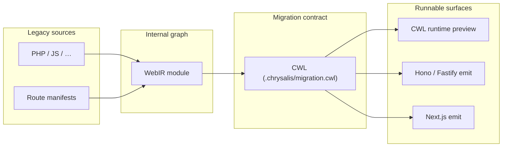
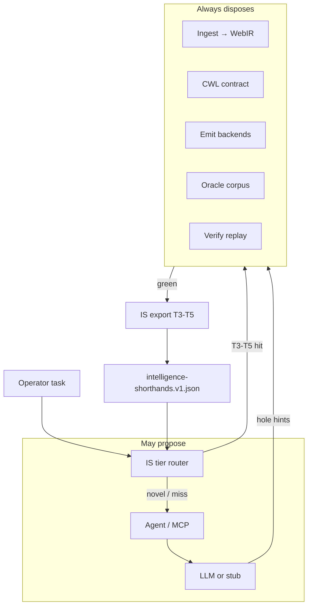

# CWL, Intelligence Shorthand, and verified migration

This document is the technical overview behind **AgenticOp** and the open-source **Chrysalis** engine. It explains why **CWL** (Chrysalis Web Language) is the migration contract, how **Intelligence Shorthand (IS)** stores agent and LLM intelligence at a fraction of model weight cost, and how **oracle + verify** remain the authority when anything is promoted to production.

It is written for engineers evaluating Chrysalis, operators running migration programs, and teams wiring agents through the Web-LLM MCP surface. For day-to-day commands, see the [User guide](./USER-GUIDE.md). For production setup, see [Operations](./OPERATIONS.md) and [Deployment](./DEPLOYMENT.md).

Figures use Mermaid; they render in GitHub, GitLab, and the [agenticop.io whitepaper](https://agenticop.io/whitepaper.html).

---

## 1. The problem with “translate and pray”

Legacy web applications encode years of business rules, accidental APIs, and SQL that became the contract. Teams face two bad options:

- **Rule-based translators** that map syntax to syntax. The output compiles; whether it matches production is unknown until something breaks.
- **LLM rewriters** that produce plausible code. The output reads well; whether it matches production is still unknown.

Chrysalis and AgenticOp take a third path:

1. **Represent the target in CWL** — a reviewable web language with route contracts, effects, and full-stack surfaces.
2. **Capture what the legacy app actually did** for real requests (the oracle corpus).
3. **Replay that corpus** against CWL runtime or emitted Node with time and randomness pinned.
4. **Store verified intelligence as shorthand** — oracle refs, CWL policy graphs, and skill capsules — so agents **skip the LLM** when coverage already exists.

**Charter invariant:** *Models propose; WebIR + oracle + verify dispose.*

If replay agrees and holes are closed, you have evidence — not faith — that the new surface behaves like the old one on the inputs you serve. If they disagree, divergence reports point at specific IR nodes and routes.

---

## 2. CWL — the migration contract

### Why a web language, not only TypeScript emit

Emitting Hono or Fastify from WebIR is necessary for adoption, but **TypeScript alone is not the contract teams should own**. Generated handler trees are hard to diff in PRs, hard to port across frameworks, and easy to treat as disposable build output.

**CWL** is Chrysalis’s **authoritative web language** for migration:

- Routes declare HTTP method, path, parameters, body bindings, response status, and content-type.
- Middleware presets (`use json`, `use urlencoded`, `use auth session|bearer`) lower to WebIR effect sets.
- Full-stack authoring includes `@page`, layouts, and `return html` for HTML surfaces.
- **Project export** writes `.chrysalis/migration.cwl`; **semantic diff** produces reviewable added/removed/changed route tables for PRs.
- **Round-trip** preserves semantics: CWL → WebIR → emit (Hono, Fastify, Next.js, …) or **CWL runtime** preview.

CWL is the artifact AgenticOp engagements center: operators and reviewers work in CWL; emit backends are interchangeable views of the same graph.

### CWL in the pipeline



**WISP** (the in-repo management demo) exists to **showcase** CWL in a production-shaped app. Language and engine wins generalize beyond any single WISP route table.

### Holes stay honest

When ingest cannot lower a construct safely, Chrysalis inserts a **hole** — typed, with provenance and a stable reason (`legacy:…`, `auth:…`). Holes compile through delegating stubs; they appear in dashboards and `chrysalis.holes.json`. They are the unit of progress, not silent best-effort translation.

---

## 3. Intelligence Shorthand — the LLM strategy

### The question

Can you store “LLM intelligence” in **orders of magnitude** less space and GPU than full weights?

- **General intelligence in weights alone:** effectively **no** beyond ~10× compression before capability collapse (quantization phase-transition research, 2024–2026).
- **Domain migration intelligence (Chrysalis-shaped tasks):** **yes — 10³–10⁷×** for verified slices — by **externalizing** behavior into oracle traces, CWL policy, and skill capsules instead of neural weights.

Chrysalis’s moat is the second path.

### IS tier ladder

```
IS-T5 oracle-ref     ← ground truth (verify replay traces)
IS-T4 policy-graph   ← CWL / WebIR modules (deterministic)
IS-T3 skill-capsule  ← verify-gated procedural digest (~0.5–5 KB)
IS-T2 lora-delta     ← domain adapter on frozen base (optional)
IS-T1 quantized      ← shared 4-bit base model (~3.5 GB)
IS-T0 weights        ← full neural baseline (~14 GB)
```

**Selection rule:** prefer the **lowest tier** that passes verify:

```text
if oracle_replay_covers(task)     → IS-T5 (no LLM)
else if cwl_policy_covers(task)   → IS-T4 (no LLM)
else if verified_skill_exists     → IS-T3 (retrieve capsule; often skipLlm)
else if domain_adapter_trained    → IS-T2 (LoRA on base)
else                              → IS-T1/T0 (model proposes)
```

| Tier | Typical size | Role |
| --- | --- | --- |
| **T5** | KB per route | Oracle trace + fixture — replay is the answer |
| **T4** | KB per module | CWL/WebIR — deterministic policy |
| **T3** | 0.5–5 KB | Skill capsule: verify gate + tool footprint + digest |
| **T2** | 50–500 MB | LoRA delta when novel surface needs adaptation |
| **T1/T0** | GB | General propose when nothing else covers the task |

A verify-green **site-port** on a small fixture can produce **CWL + oracle proof + IS-T3 capsule** in **≪1 MB** versus **~14 GB** to hold equivalent behavior in a 7B model — for that **domain slice**.

### Runtime and agents

Package **`@chrysalis/web-llm`** implements:

- **`resolveShorthandForTask`** — tier selection, retrieval, `skipLlm` when T3–T5 cover the task
- **Trajectory export** — `skipLlm`, `isTier`, `isRetrievalHit`, `needsNovelLanguage` on agent runs
- **WVB** (Web Verify Benchmark) — fixture-derived eval cases from verify-green ports
- **MCP tools** — `web_llm_resolve_shorthand`, hub convert enrich / verify gate / apply holes

Export pipeline:

```bash
chrysalis port-site <fixture> --origin php
pnpm run web-llm:export-shorthand
pnpm run web-llm:build-shorthand-hub
```

Artifact kind: `chrysalis.web-llm.intelligence-shorthand`. Federation index: Open Legacy entries drive per-domain T3/T4/T5 export.

Full specification: [INTELLIGENCE-SHORTHAND.md](./INTELLIGENCE-SHORTHAND.md) and [INTELLIGENCE-SHORTHAND-PROTOCOL.md](./INTELLIGENCE-SHORTHAND-PROTOCOL.md).

### LLM-assisted convert (verify-gated)

Phases 42–43 closed **LLM convert assist** and **full** workflows:

1. **IS routing** runs before any model call.
2. **Enrich** proposes hole closures (live API or CI-safe stub).
3. **Verify gate** requires correctness ≥ 1 — no apply without it.
4. **Operator apply** requires explicit confirmation.
5. **Repair bridge** connects to `@chrysalis/repair` when traces and hub verify URL are available.

This is **not** autopilot migration. It is **accelerated propose** under the same dispose layer.

---

## 4. How the pieces compose

Chrysalis is one CLI; these processes are independent:

| Process | What it answers |
| --- | --- |
| **Parse + ingest** | What is the structure and intent of the source? |
| **CWL export** | What is the human-reviewable migration contract? |
| **Emit** | What does the graph look like as a buildable Node project? |
| **Oracle capture** | What did the running legacy app do for real inputs? |
| **Verify replay** | Does the new surface reproduce captured responses? |
| **IS export** | What verified intelligence can agents retrieve next time? |
| **Chimera** (optional) | Which stack serves this request in production? |



Static lowering can be sound and incomplete. Captured traces cover behavior analysis never sees. Replay checks what the wire shows. IS stores what verify already proved. Value comes from **combining** them.

---

## 5. End-to-end lifecycle

1. **Establish routes** — `chrysalis.routes.json` or hub discovery maps entry points to HTTP pairs.
2. **Parse and ingest** — AST → WebIR; holes for unsupported constructs.
3. **Export CWL** — `.chrysalis/migration.cwl`, preview JSON, semantic diff vs baseline.
4. **Emit** (when needed) — Hono, Fastify, or other backends from the same WebIR.
5. **Record traces** — Oracle `auto_prepend_file` captures requests, SQL, sessions, time/randomness.
6. **Replay** — `chrysalis verify` against emitted server or CWL runtime; per-route correctness scores.
7. **Export shorthand** — verify-green ports feed IS-T3 capsules and T4/T5 policy/oracle refs.
8. **Agent loops** — trajectories, WVB scoring, MCP convert assist; always verify-gated.
9. **Cutover** — Chimera shadow → canary → cutover when confidence clears your bar.

Steps 2–4 are compile-time. Steps 5–6 are behavioral conformance. Step 7 grows the shorthand corpus. Step 8 is optional acceleration. Step 9 is operations.

---

## 6. WebIR — the graph behind CWL

WebIR is the typed, multi-dialect IR between source frontends and emit backends. CWL is a **surface** over that graph; ingest lowers source into WebIR; CWL parser and export round-trip through the same nodes.

| Dialect | Represents |
| --- | --- |
| `web.request` | Routes, handlers, request/response shapes |
| `effect` | DB, mail, cache, session, time, randomness, outbound HTTP |
| `data` | Value flow between steps |
| `control` | Loops and branches after extraction |
| `target.ts` | TypeScript-specific lowering shapes |

Every node carries `id`, `type`, `effects`, `provenance`, and `origin` so verify failures can attribute divergence to neighborhoods in the graph.

For large repos: route sharding, AST cache, and `mergeWebIrModules` scale ingest without changing the merged graph semantics.

---

## 7. Oracle capture

A PHP prepend file (and analogous paths for other origins) records:

- HTTP request and response
- SQL with parameters (and optional row payloads for SELECT)
- Session reads and writes
- Outbound HTTP, time reads, randomness reads

Traces land as dated NDJSON under a corpus directory. **Redaction runs before persistence** — defaults aligned between TypeScript and PHP implementations; drift is a CI break.

Redis session bridging allows the same user to move between legacy PHP and Node stacks during chimera cutover.

---

## 8. Verify replay

Given a corpus and a running server (emitted or CWL runtime), verify:

1. Loads and validates traces
2. Replays in deterministic order
3. Pins time and randomness via headers (`x-chrysalis-now-iso`, `x-chrysalis-random-seed`)
4. Uses live DB or SQL tape when row payloads were captured
5. Diffs status, headers, body with an **allowlist-only** normalization ruleset
6. Emits `summary.json` and per-route reports for CI

Shadow mode on Chimera uses the **same** comparison vocabulary so production observation and CI replay produce comparable signals.

---

## 9. Chimera dual-stack routing

`chrysalis deploy` serves legacy PHP, modern Node/CWL, or both:

| Mode | Behavior |
| --- | --- |
| **legacy** | All traffic to PHP |
| **cutover** | Matched routes to modern stack |
| **shadow** | PHP serves client; mirror to modern async; diff log |
| **canary** | Sticky percentage of modern-eligible traffic |

Configuration is HTTP routing only — no WebIR interpretation at the edge.

---

## 10. Site → CWL → LLM product loop

Closed program (**G8400**, **G8290**, **G8560**, **G8600**):

```text
Site → site intelligence → ingest → WebIR → CWL → verify
  → trajectory JSONL → WVB cases → training shards
  → port report → IS export (T3/T4/T5)
```

**“Building an LLM” in Chrysalis** means **corpus + benchmark + MCP + shorthand artifacts** — not in-repo foundation model training. Optional **Horizon C** IS-T2 LoRA runs on sponsor GPU lab prep (`docs/GCE-GPU-LAB.md`); not the default maintenance queue.

Programs:

| Program | Focus |
| --- | --- |
| [SITE-TO-CWL-LLM-PROGRAM.md](./SITE-TO-CWL-LLM-PROGRAM.md) | Port-site → trajectory → shards |
| [OPEN-WEB-LLM-PROGRAM.md](./OPEN-WEB-LLM-PROGRAM.md) | Framework, WVB, MCP (not foundation model) |
| [LLM-ASSISTED-CONVERT-PROGRAM.md](./LLM-ASSISTED-CONVERT-PROGRAM.md) | Verify-gated propose |
| [LLM-CONVERT-FULL-PROGRAM.md](./LLM-CONVERT-FULL-PROGRAM.md) | Enrich + apply + repair bridge |

---

## 11. Adjacent packages (unchanged role)

| Package | Role |
| --- | --- |
| **Archaeology** | DDL + trace intersection → `domain.ts` / schema |
| **Insight** | Static IR pattern findings |
| **Rewrite** | Gated IR transforms with optional behavior verify |
| **Repair** | Verify-failure loop with proposer (stub or LLM) |
| **Compat** | PHP-shaped runtime helpers; idiomaticity metric |
| **License** | Optional commercial CLI gate |

---

## 12. AgenticOp’s layer

**Chrysalis** (MIT) is the engine. **AgenticOp** is the practice:

- Corpus design and redaction policy
- CWL review and migration contract governance
- Verify thresholds in CI and shorthand corpus growth on green waves
- Chimera cutover playbooks
- Agent/MCP enablement with verify-first discipline

Commercial services and support: [COMMERCIAL.md](./COMMERCIAL.md). Brand and hosting: [AGENTICOP.md](./AGENTICOP.md).

---

## 13. Implementation stack

- **Language:** TypeScript strict mode, Node.js 20+
- **Workspaces:** pnpm 9; `pnpm -r build`; `pnpm test` (Vitest)
- **PHP:** Oracle capture, nikic parser provider, PHP smoke tests
- **CLI:** `packages/cli/dist/bin.js`; Python/Go shims invoke the same binary

---

## 14. Where to dig further

| Document | Contents |
| --- | --- |
| [DESIGN.md](../DESIGN.md) | Non-negotiables and decision log |
| [CWL-RFC.md](./CWL-RFC.md) | Accepted CWL language RFCs |
| [INTELLIGENCE-SHORTHAND.md](./INTELLIGENCE-SHORTHAND.md) | IS tiers, feasibility, export |
| [INTELLIGENCE-SHORTHAND-PROTOCOL.md](./INTELLIGENCE-SHORTHAND-PROTOCOL.md) | Runtime fields and MCP |
| [STRATEGIC-PLAN.md](./STRATEGIC-PLAN.md) | Locked build order (maintenance: G8550) |
| [ROADMAP.md](../ROADMAP.md) | Status and closed phases |
| [packages/web-llm/README.md](../packages/web-llm/README.md) | Public API for shorthand and trajectories |

For hands-on introduction: [User guide](./USER-GUIDE.md) and [HOW-TO.md](./HOW-TO.md).
