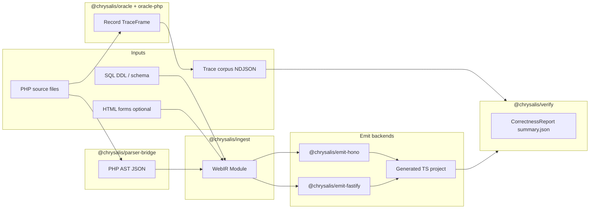
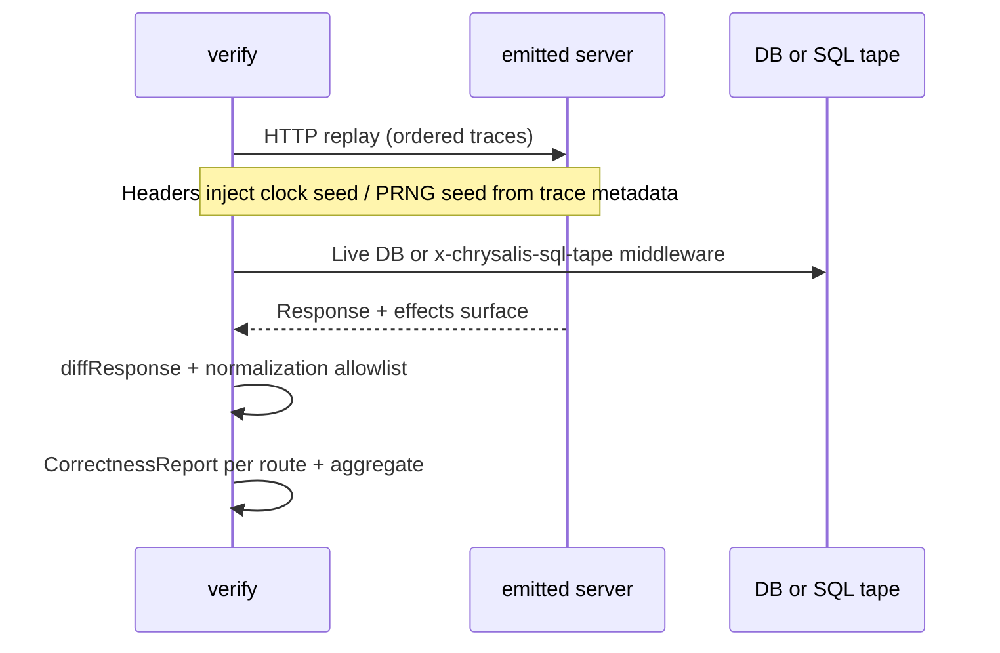
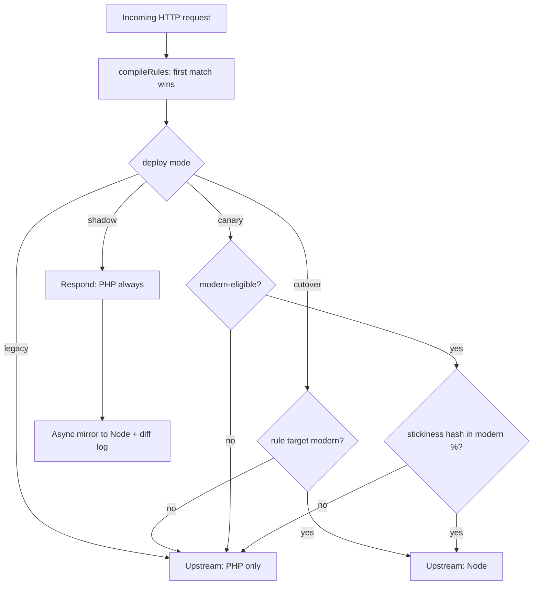

# Chrysalis: Technical Overview

**Document type:** architecture and implementation summary  
**Audience:** engineers evaluating or integrating the system  
**Scope:** repository version aligned with root `package.json` (e.g. **2.0.x**); specifics refer to packages under `packages/`  
**Figures:** Mermaid diagrams below render as vector graphics in GitHub, GitLab, and many Markdown preview tools.

**Disclosure scope:** This paper explains **roles, data contracts, and integration boundaries** as reflected in public repository documentation (`DESIGN.md`, `README.md`, package `README.md` files). It does not enumerate every heuristic, scoring tweak, or internal optimization. Anything not stable across releases belongs in source and tests, not in a fixed narrative here.

---

## 1. Positioning (non-marketing)

**Chrysalis** is a **monorepo** that implements:

1. A **multi-dialect intermediate representation (IR)** for web applications (**WebIR**).
2. A **behavioral capture** layer that persists HTTP/SQL/session/time observations as structured traces (**Oracle**).
3. A **replay-based verifier** that executes emitted handlers against those traces (**Verify**).
4. Optional **production routing** between a legacy PHP upstream and a generated Node/TypeScript upstream (**runtime-chimera**).

The PHP-to-TypeScript path is one **frontend** (parse + ingest) and one family of **backends** (emitters). The IR and verification machinery are intended to outlive any single language pair.

### 1.1 Four orthogonal processes (how they relate)

These are **separate concerns** that compose:

| Process | Question it answers | Typical when |
|--------|---------------------|--------------|
| **Parse + ingest** | What does the **source** say the program structure and intent are? | CI or developer machine; no PHP app traffic required beyond parsing. |
| **Emit** | What **target-language project** implements that IR for a chosen framework? | After ingest; produces buildable TypeScript. |
| **Oracle (record)** | What did the **running legacy app** actually do for real inputs? | Staging/production observation windows; exercises runtime + DB + extensions. |
| **Verify (replay)** | Does the **emitted app** reproduce **observed** HTTP responses (under controlled nondeterminism rules)? | CI or release gates; needs corpus + running emitted server. |
| **Chimera (optional)** | Which **upstream** serves this HTTP request in production, without splitting cookies or origin? | Dual-stack rollout; orthogonal to whether you ran verify in CI. |

None of these replaces the others: static lowering can be sound yet incomplete; traces can cover behavior branches that static analysis never sees; replay checks **observable** agreement, not proof of total correctness.

---

## 2. End-to-end lifecycle (conceptual)

A common adoption shape:

1. **Establish routes and project roots** — manifests tell ingest which PHP entrypoints correspond to HTTP routes (see `chrysalis.routes.json` in operator docs).
2. **Parse PHP** — syntax becomes AST JSON (no runtime execution at this stage).
3. **Lower AST to WebIR** — structured graph with effects, types, provenance; gaps become **holes**, not silent omissions.
4. **Emit TypeScript** — WebIR lowers to handler modules, wiring, and runtime adapters for the chosen stack (e.g. Hono or Fastify).
5. **Record traces** — Oracle prelude captures requests/responses and side-effect streams from the **legacy** stack into NDJSON corpora.
6. **Replay against emitted app** — Verify sends the same HTTP sequences (with determinism hooks), compares responses, and writes reports (aggregate correctness, per-route detail, divergence kinds).
7. **Iterate** — holes shrink via ingest/emit improvements; divergences shrink via fixes or expanded traces; optional **repair** proposes IR edits that must pass verify again.
8. **Route traffic (optional)** — Chimera proxies to legacy or modern per rule, including shadow and canary modes.

Steps 2–4 are **compile-time translation**. Steps 5–6 are **behavioral conformance**. Step 8 is **operations**.

---

## 3. High-level data flow

Figure 1 shows the main artifacts and packages. Solid arrows are typical batch/CI flows; the Oracle records from a live or staged PHP process.

### 3.1 Terms

| Term | Definition |
|------|------------|
| **WebIR `Module`** | Typed graph of nodes spanning dialects (`web.request`, `effect`, `data`, `control`, `target.ts`, …). |
| **`TraceFrame`** | One recorded unit of behavior (request/response slice plus ordered effects such as SQL, session, outbound HTTP). |
| **`TraceCorpus`** | Deduplicated, append-only collection of frames on disk (typically NDJSON trees by date). |
| **`CorrectnessReport`** | Aggregate and per-route scores plus divergence metadata after replay. |

### 3.2 Narrative walkthrough of Figure 1

- **PHP to AST:** Only lexical/syntactic structure; comments and formatting are largely irrelevant except where PHPDoc hooks exist. Output is JSON-shaped AST for consumption by TypeScript.
- **AST to WebIR:** Semantic lowering **per route/project**: identifies calls that imply I/O, session, redirects, etc., and builds a graph amenable to codegen. External inputs (DDL, optional HTML/form scan) refine types or boundaries.
- **WebIR to TS:** Pure codegen from IR plus emit strategy flags (how routes register, how imports dedupe, etc.). Changing PHP later requires re-ingest and re-emit; Chimera does not patch IR.
- **PHP app to corpus:** Independent pipeline: runtime instrumentation observes **facts** about requests and effects. It does not parse WebIR.
- **Corpus + emitted server to report:** Replay drives **black-box HTTP** comparison (plus optional SQL tape), attributing failures back to IR node ids when the CLI wires module metadata through.

---

## 4. WebIR (intermediate representation)

### 4.1 Purpose

WebIR is the **stable contract** between frontends (today: PHP via ingest) and backends (today: TS emitters). Framework-specific details (Hono vs Fastify) are pushed toward **`target.ts`** and emit packages so the core IR stays **framework-agnostic**.

It is modeled after **multi-level IR** ideas (cf. MLIR): separate **dialects** with explicit lowering order so high-level web routing concepts do not leak into low-level data ops prematurely.

### 4.2 Dialects (conceptual stack)

| Dialect | Role |
|---------|------|
| `web.request` | Routes, handlers, middleware-shaped boundaries, auth-adjacent tagging. |
| `effect` | Side effects: database read/write, mail, cache, session mutation, clock, RNG, outbound HTTP, etc. |
| `data` | SSA-style pure dataflow (scalars, aggregates). |
| `control` | Structured control flow after extraction/lowering. |
| `target.ts` | TypeScript-oriented ops for emission. |

**How lowering is used (conceptually):** Higher dialects preserve **intent** (what the HTTP handler means to do). Lower dialects make that intent **executable** in codegen. Passes may rewrite nodes but are expected to preserve or refine **provenance** so audits remain possible.

### 4.3 Per-node metadata (invariant)

Documented invariants attach auditability to each node:

- **`id`**: stable `NodeId` for reports and repair attribution.
- **`type`**: static `WebIRType` (may be unknown or hole-shaped).
- **`effects`**: `EffectSet` carried on signatures.
- **`provenance`**: list of `{ source, locator, reason }` explaining derivation.
- **`origin`**: locator back to PHP (file:line:col), DDL, form scan, or trace.

This metadata is how verify can point engineers at **likely IR regions** when responses diverge, without claiming perfect blame assignment.

### 4.4 Holes (partial compilation)

A **hole** is a **first-class IR node** for constructs not lowered yet (or deliberately delegated). Properties:

- **Typed boundary** — inputs/outputs are not arbitrary `unknown` blobs unless the IR truly cannot infer more.
- **Named reason** — appears in migration dashboards and reports (`legacy:…`, `auth:…`, etc., where applicable).
- **Non-fatal** — ingest continues; emit emits a delegating path compatible with dual-stack operation.

Holes are how the pipeline stays **honest**: “unknown” is explicit, measurable, and schedulable work— not silent omission.

### 4.5 Static oracle footprint (offline signal)

Separate from recording traffic, WebIR can be analyzed to summarize **what replay would need to hydrate** per route (effects footprint). That analysis is **pure IR**— useful for estimating verify cost and catching surprises before spinning environments. See `DESIGN.md` and CLI `status` documentation for the artifact shape.

---

## 5. Parser bridge (`@chrysalis/parser-bridge`)

### 5.1 Purpose

Convert **PHP source text** into a **canonical, version-stamped AST JSON** consumable from Node/TypeScript.

**Boundary:** Parsing only. No type inference, no WebIR, no evaluation.

### 5.2 How it works (process)

1. **Select provider** — `glayzzle` (default, self-contained) or `nikic` (subprocess + Composer vendor).
2. **Run parser** — Produce PHP-parser-native structure.
3. **Normalize** — Map into **`PhpAst`**, a TypeScript discriminated union with a pinned schema (golden tests detect drift).
4. **Return** — AST to ingest; bridge remains stateless per invocation.

### 5.3 Why two providers

- **Default path** favors **zero external Composer** for basic CI and quickstarts.
- **Nikic path** favors **parity-sensitive** syntax (namespaces, certain dynamic constructs, edge cases) where the default parser may differ.

Switching providers changes AST detail; ingest must interpret either consistently. The repo documents shared normalization goals (e.g. qualified names, static method surfaces for call maps).

### 5.4 Operational note

`vendor/` for `nikic` is typically machine-local or CI-generated (Composer install scripts). That keeps the git tree small while still allowing reproducible installs.

---

## 6. Ingest (`@chrysalis/ingest`)

### 6.1 Purpose

Transform **`PhpAst` + project configuration** into a **`WebIR Module`** representing the routed PHP surface area.

**Boundary:** Ingest interprets PHP **as modeled by Chrysalis**, not a full PHP semantics emulator. Unsupported constructs become holes or conservative effects.

### 6.2 Inputs

- Parsed AST per file.
- **Route manifest** — ties filesystem paths to HTTP methods/paths.
- Optional **Composer-aware** widening for call effects (vendor/lib breadth policy is documented in package README).
- Optional **declared DB factory callees** in manifest for receiver typing on query calls without full inference.

### 6.3 Processing (conceptual stages)

1. **Route anchoring** — Establish handler boundaries and request/response shapes at the granularity Chrysalis supports.
2. **Effect extraction** — Recognize builtins and framework-shaped calls mapped to WebIR effects (DB, session, time, redirect, etc.).
3. **Dataflow construction** — Build SSA-style `data` nodes for expressions and assignments where modeled.
4. **Control lowering** — Loops/branches become `control` dialect representations suitable for later passes.
5. **Hole insertion** — Any construct outside the supported subset becomes an explicit hole with stable reason text (never silent deletion).
6. **Auth-adjacent tagging** — Certain patterns receive prefixes/reasons so downstream dashboards separate security-adjacent residuals.

Exact ordering and pass names are implementation details; the **observable contract** is deterministic IR for a given AST + options.

### 6.4 Outputs

- **`Module`** graph plus metadata (timestamps may vary).
- Reports consumed by CLI **`status`** / migration summaries (hole counts, dialect totals).

### 6.5 Scale-out (how large repos are handled)

- **Route sharding** — Only a subset of routes is lowered per invocation; shard index is deterministic from route file paths.
- **Merge** — `mergeWebIrModules` combines shard outputs; structural dedupe reduces redundant subgraphs where safe.
- **Optional AST cache** — Keyed by source hash + parser provider + cache version to skip repeated parsing when sources are unchanged.

These mechanisms change **wall time and memory**, not the semantic goal: full-project IR when shards are merged.

---

## 7. Emit layer

### 7.1 Purpose

Turn **WebIR** into a **buildable TypeScript application** for a concrete HTTP framework and data access style.

**Boundary:** Emitters trust IR types/effects; they should not re-parse PHP.

### 7.2 How emission is structured

1. **Strategy selection** — CLI flags choose registration style (lazy vs eager), import barrels, deduplicated handler bodies, runtime facade modules, route path constants, fingerprints, etc. (`@chrysalis/emit-shared`).
2. **Per-route codegen** — Handlers become async functions with framework adapters wrapping IR-lowering results.
3. **Wiring** — Route tables, middleware for cookies/SQL tape/determinism headers as enabled.
4. **Artifacts** — TypeScript sources, `package.json`, configs—whatever the template for that emitter requires.

### 7.3 Dual backends (why two)

**Hono** and **Fastify** stacks prove **IR portability**: the same module should typecheck and replay under both when fixtures claim parity. Divergence between backends indicates emitter bugs or unsupported framework assumptions—not “PHP semantics changed.”

### 7.4 Relationship to verify

Emitted servers honor **determinism headers** used by verify (clock/RNG injection). Emit packages document middleware hooks (e.g. SQL tape) that make offline replay possible without a live database when traces include sufficient SQL payloads.

---

## 8. Oracle (`@chrysalis/oracle`, `packages/oracle-php`)

### 8.1 Purpose

Record **observable behavior** of the legacy PHP application into durable traces so replay can treat reality as the specification.

**Boundary:** Observation, not translation. Oracle does not emit TypeScript.

### 8.2 How recording fits in the request path

At a high level:

1. HTTP request enters the instrumented PHP stack (exact integration depends on deployment— prelude/bootstrap as documented).
2. **Effects are intercepted** at supported boundaries: DB drivers, session APIs, selected outbound calls, time/RNG reads, etc.
3. Each logical transaction emits **`TraceFrame`** slices into NDJSON streams organized by capture policy (e.g. date buckets).
4. **Redaction runs before persistence** — secrets never reach disk in clear text under default rules.

### 8.3 What gets captured (categories)

- **HTTP** — Method, path, headers, bodies; response status/headers/body.
- **SQL** — Query text, bind metadata where available; optional row payloads for SELECT replay.
- **Session** — Mutations relevant to continuity across requests.
- **Time/RNG** — Values needed so replay can inject the same decisions without mocking entire libc.

### 8.4 Redaction model (why two implementations)

TypeScript ships **`DEFAULT_REDACTION`** rules; PHP **`Redactor.php`** mirrors them at capture time. **Lockstep** prevents divergent privacy posture between documentation and runtime. Operators may extend rules via **`chrysalis.observe.json`** merges documented in package README.

### 8.5 Corpus properties

- **Append-only** — New observations extend history; deduplication avoids unbounded identical duplicates.
- **Content-addressed dedupe** — Stable identity for frames where applicable.

### 8.6 Session bridge (cross-stack continuity)

For Redis-backed shared sessions, PHP registers a documented session handler; Node middleware reads/writes the same logical session. This is **infrastructure alignment**, not IR: both stacks must agree on serialization and cookie naming (`CHRYSALIS_SESSION_REDIS_URL` and related operator docs).

---

## 9. Verify (`@chrysalis/verify`)

### 9.1 Purpose

Answer: **Does the emitted application reproduce legacy-observed HTTP behavior for captured traces**, modulo an explicit normalization policy?

This is **regression testing against production-shaped inputs**, not formal verification.

### 9.2 Preconditions

- A **running base URL** for the emitted app.
- A **corpus directory** readable by the verifier.
- Optional: SQL row payloads in traces if SELECT replay via tape is desired.

### 9.3 How replay executes (step-by-step)

1. **Load corpus** — Parse and validate trace files into memory structures.
2. **Sort traces** — Deterministic order (typically capture timestamp) so reruns are comparable.
3. **Iterate frames** — For each HTTP capture:
   - Issue `fetch` (or injected HTTP client) against the emitted server path.
   - Forward cookies along the chain when **cookie chaining** is enabled (simulates one browser/session continuity).
   - Attach determinism headers derived from trace ids/metadata so server-side clock/RNG hooks align with recorded behavior.
4. **Database behavior** — Either connect to a real DB provisioned for test, or enable **recorded SQL tape** middleware so SELECT-shaped queries consume captured rows in order (documented header channel).
5. **Compare** — Pairwise diff of status, headers, body using **`diffResponse`**; body comparison may include **Jaccard similarity** scoring as documented in project README for fuzzy body comparison scenarios.
6. **Normalize** — Allowlisted transforms mask known benign drift (timestamps, rotating session cookie values, UUIDs). Each applied rule is recorded on outcomes so masking cannot hide surprises silently.
7. **Aggregate** — Produce **`CorrectnessReport`**: per-route stats, aggregate score, failure counts.
8. **Attribute (optional)** — When WebIR module metadata is wired in, attach candidate **`NodeId`** lists to failing traces for developer navigation.

Figure 2 summarizes the interaction shape.

### 9.4 Partitioning and merging

Large corpora may shard replay by trace hash buckets (**shardCount** / **shardIndex**). Each shard writes its own report; **`mergeCorrectnessReports`** merges disjoint partitions. This is **operational parallelism**, not a different definition of correctness.

### 9.5 Outputs

- Files under a report directory (`summary.json`, per-route files).
- Optional single-line **`chrysalis.verify.summary`** JSON on stdout for CI ingestion (`schemaVersion: 1`).

### 9.6 Relationship to Chimera shadow mode

Shadow mode mirrors traffic to modern and diffs using the **same primitive comparators** as offline verify where possible, so production observation and CI replay share vocabulary— even though latency and failure handling policies differ (shadow must not affect client-visible responses).

---

## 10. Chimera runtime (`@chrysalis/runtime-chimera`)

### 10.1 Purpose

Provide **one origin** for clients while **two implementations** (PHP and Node) coexist behind the scenes— enabling incremental cutover without changing public URLs or splitting cookies at the browser.

### 10.2 What the process does on each request

1. Accept TCP HTTP at the proxy.
2. **Match route rules** — First match wins; patterns are documented string forms (`/path`, `/prefix/*`, `METHOD /path`).
3. **Select upstream** based on **mode** and rule target (`legacy` vs `modern`).
4. **Forward** — Proxy the request to PHP or Node; attach observability response headers indicating which path served or mirrored.
5. **Shadow-specific** — Respond only from legacy; schedule asynchronous mirror to modern; diff and append NDJSON records without affecting the client response path latency contract beyond fire-and-forget work.

### 10.3 Modes (exact strings)

| Mode | Client-visible behavior |
|------|-------------------------|
| `legacy` | All traffic to PHP upstream. |
| `cutover` | Rule-matched paths to modern; others to PHP. |
| `shadow` | Client always receives PHP response; modern receives a mirrored request; diffs logged (NDJSON compatible with verify primitives). |
| `canary` | Like cutover but only a configured percentage of modern-eligible traffic hits modern; deterministic stickiness via cookie/header/IP salt. |

### 10.4 Configuration and operations

- **Versioned JSON** (`kind: chrysalis.chimera.config`, `schemaVersion: 1`) loads declaratively.
- **Optional HMAC** — Detect tampering of config payloads in centralized distribution setups (documented env/flags).
- **Remote config URL + signals** — Reload paths documented for operators who centralize rule rollout.

Chimera **does not** interpret WebIR; it is pure HTTP routing and observability.

---

## 11. Adjacent packages (what they add to the pipeline)

### 11.1 Archaeology (`@chrysalis/archaeology`)

**Purpose:** Improve **type honesty** for persisted data by intersecting **DDL** with **observed trace shapes**.

**How:** Reads schema artifacts and trace summaries, emits domain types (often with **`@chrysalis-provenance`** comments) tying fields back to columns and observed value sets. This reduces guesswork compared to syntax-only translation.

### 11.2 Insight (`@chrysalis/insight`)

**Purpose:** Static reports on code shape (e.g. dispatch patterns) that inform **rewrite** or **emit** choices.

**How:** Parses/analyzes PHP or IR-adjacent inputs per tool— outputs JSON consumed by CLI gates documented in root scripts.

### 11.3 Rewrite (`@chrysalis/rewrite`)

**Purpose:** Catalog of **intent-preserving** transforms (e.g. safer idioms) with provenance stamps.

**How:** Rewrites are applied in controlled passes; they must preserve the audit story— not swap semantics silently.

### 11.4 Repair (`@chrysalis/repair`)

**Purpose:** Close the loop after verify failures by proposing **IR-level** fixes.

**How:** Any automated proposal path is **verify-gated**: a repair is only “accepted” if replay improves under the same thresholds. Optional LLM involvement is scoped and non-authoritative by design.

### 11.5 Compat (`@chrysalis/compat`)

**Purpose:** Escape hatches and shims when idiomatic output is not yet available.

**Boundary:** Explicitly **not** the default posture; compat exists so teams can integrate before coverage is complete.

### 11.6 CLI (`@chrysalis/cli`)

**Purpose:** Single **`chrysalis`** entrypoint orchestrating ingest, emit, verify, deploy, corpus merge, status, etc.

**How:** Subcommands chain packages; many JSON artifacts are schema-versioned for CI (`--json-summary`, merge summaries, ingest progress, chimera operator snapshots— see root `README.md` tables).

### 11.7 License (`@chrysalis/license`)

**Purpose:** Optional **local** enforcement of commercial CLI tiers via environment variables documented in `docs/COMMERCIAL.md`.

**Boundary:** Does not change IR semantics; gates command availability only where configured.

---

## 12. CLI orchestration (how processes chain)

Typical **project-scoped** flows:

- **`ingest`** — Parse + lower to IR (optional shard merge).
- **`emit`** — Often re-invokes ingest internally unless IR is cached— exact behavior documented in CLI README.
- **`verify --project`** — Ensures ingest/emit paths align with manifests, then runs replay.
- **`status --project`** — Aggregates corpus metrics, verify outcomes, hole counts, optional sidecars.

This layering matters: **verify** is not a substitute for **status**, and **emit** is not a substitute for **oracle** recording— they answer different questions.

---

## 13. Implementation stack

- **Language:** TypeScript **strict** throughout.
- **Runtime:** Node.js **>= 20**.
- **Package manager:** **pnpm** workspaces (`pnpm -r build`, `pnpm test`).
- **Tests:** **Vitest**; CLI integration tests often subprocess compiled `dist/` outputs.
- **PHP:** Required for `nikic` provider tests and oracle-php smoke tests.

---

## 14. Determinism and sandbox constraints

**Design constraint:** Generated handlers and verify sandboxes avoid ambient nondeterminism (`Date.now()`, `Math.random()`, raw `process.env`, live network) where replay requires fidelity. Clock and RNG are injected via framework context; traces carry seeds for replay headers.

This is an **engineering invariant** for stable regression testing. Production Chimera traffic remains subject to real clocks and concurrent load; offline verify isolates **semantic** drift from **ambient noise** using the normalization allowlist and determinism hooks.

---

## 15. References in-repo

- **`DESIGN.md`** — canonical principles, vocabulary, and decision log pointers.
- **`ROADMAP.md`** — milestone acceptance and deferred work.
- **`README.md`** — operator-facing tables for machine JSON artifact kinds.
- Per-package **`README.md`** under `packages/*` — public API and invariants.

---

## Figure 3: Chimera mode decision (simplified)

---

*This document describes observable architecture as implemented in the repository; behavior of unreleased branches may differ. For licensing and commercial options see `docs/COMMERCIAL.md`.*
