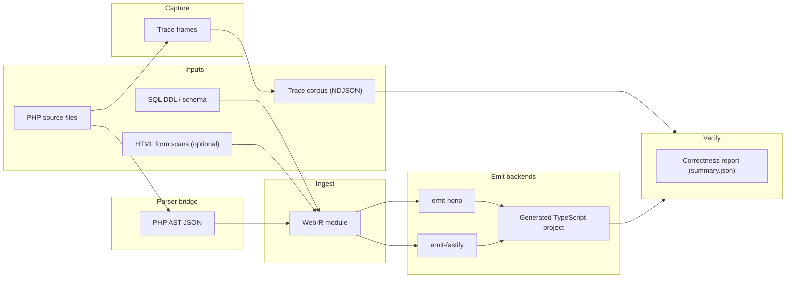
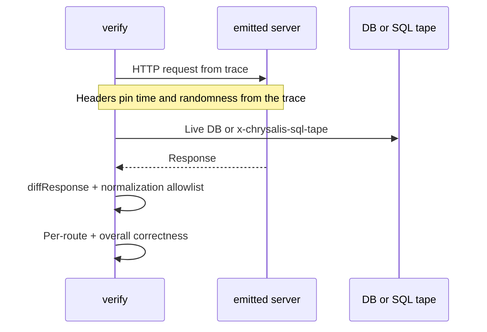
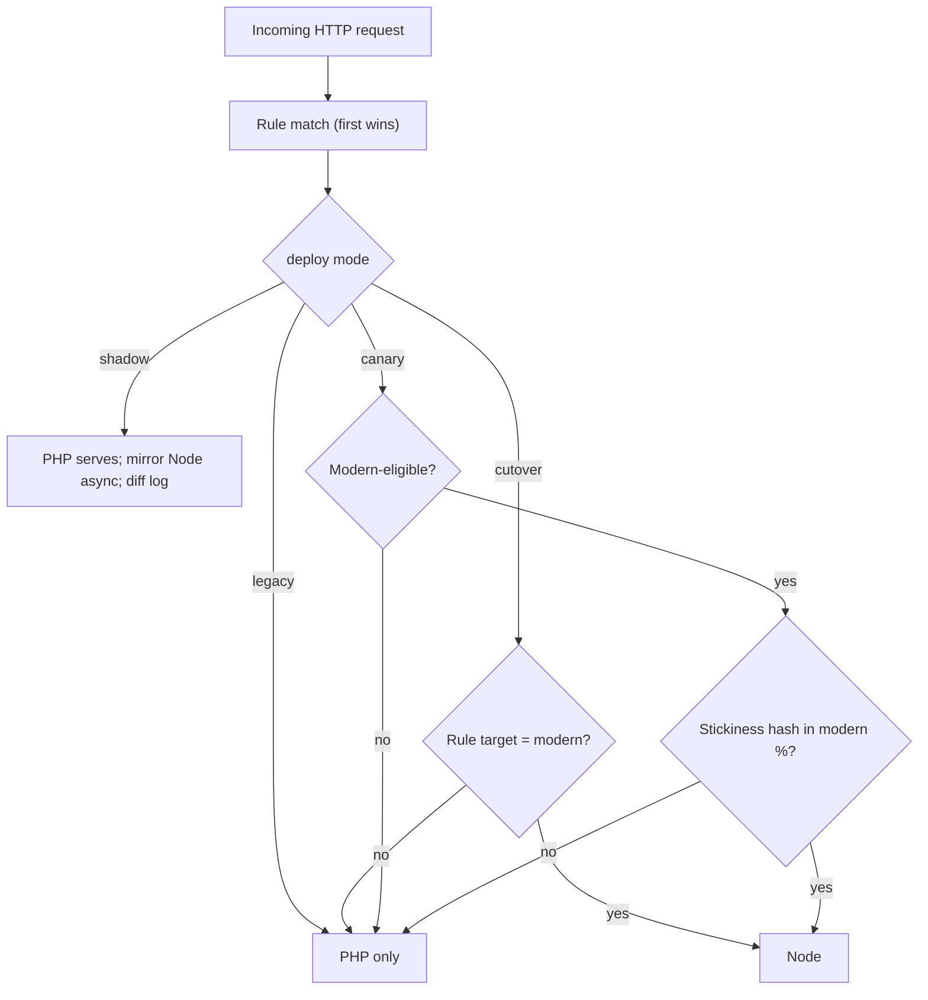

# Chrysalis: a technical overview

This is the architecture story behind Chrysalis: what each piece does, why it exists, and how the pieces compose into a system that translates a PHP application to TypeScript and proves the new code matches the old code's behavior.

It is meant for engineers evaluating Chrysalis or coming back to maintain it. If you only need the commands, read the [User guide](./USER-GUIDE.md). If you need to set things up in CI or production, read [Operations](./OPERATIONS.md) and [Deployment](./DEPLOYMENT.md).

The figures use Mermaid; they render as diagrams in GitHub, GitLab, and most Markdown previewers.

---

## 1. What problem this solves

A PHP application that has run for ten years carries the truth of the business it supports. Its functions, its odd corners, the SELECT that has accidentally been the contract for three internal teams — all of that is encoded in code that no one wants to rewrite by hand and no one trusts a tool to rewrite by guess.

Most "PHP to JavaScript" tools fall into two camps:

- **Rule-based translators** that turn syntax into syntax. They produce code that compiles. Whether it does the same thing is up to you to find out.
- **AI-assisted rewriters** that produce code that looks plausible. Whether it does the same thing is again up to you.

Chrysalis takes a different position. It splits the problem into three independent pieces and only trusts an output when the pieces agree:

1. **Translate the source** to TypeScript. When something cannot be translated safely, leave a typed placeholder ("hole") rather than guess.
2. **Capture what the old app actually does** for real requests, into a corpus of recorded HTTP, SQL, session, and side-effect data.
3. **Replay that corpus against the new code** with time and randomness pinned, and compare the responses.

If translation is sound and replay agrees, you have evidence — not faith — that the new code behaves like the old code on the inputs you actually serve. If they disagree, the divergence list points you at the specific node in the translated graph that produced the wrong answer.

That is the entire posture. Everything else in this document is mechanism that supports it.

---

## 2. Four processes that compose

Chrysalis is one CLI but five things conceptually. They are independent. None of them replaces another.

| Process | What it answers | Where it runs |
| --- | --- | --- |
| **Parse and ingest** | What is the structure and intent of the PHP source? | CI or developer machine; no live PHP traffic needed. |
| **Emit** | What does that structure look like as a buildable Node project? | After ingest. Produces TypeScript. |
| **Capture** (the "Oracle") | What did the running PHP app actually do for real inputs? | Wherever the PHP app runs (staging, observe-mode hosts). |
| **Verify** (replay) | Does the emitted app reproduce those captured responses? | CI gate or release check; needs a corpus and a running emitted server. |
| **Dual-stack router** ("Chimera"), optional | Which stack serves this request in production? | Edge proxy or sidecar; independent of CI verify. |

Static lowering can be sound and still incomplete. Captured traces cover real-world behavior that static analysis never sees. Replay checks what the wire shows — status, headers, body — not "every possible input is correct". Each process has its own honest limit; the value comes from combining them.

---

## 3. End-to-end lifecycle

A typical adoption follows these steps:

1. **Establish routes and project roots.** A small `chrysalis.routes.json` maps PHP entry points to HTTP method-and-path pairs.
2. **Parse PHP** to AST JSON. No execution.
3. **Lower the AST** to the internal graph (WebIR). Holes are inserted for things Chrysalis refuses to guess.
4. **Emit a Node project.** Typed handlers, runtime helpers, server entry, optional schema files.
5. **Record traces.** A small PHP file loaded ahead of the application captures each request and side effect into NDJSON files.
6. **Replay the corpus** against the emitted app. The verifier sends the same requests, with time and randomness pinned to the values from the trace, and diffs each response.
7. **Iterate.** Holes shrink as ingest and emit improve. Divergences shrink as you fix lowering bugs, expand traces, or accept the rewrite. The optional repair loop proposes IR edits gated on the same replay.
8. **Roll traffic** through the dual-stack router (shadow first, then canary, then cutover) when you are ready to put the new code in front of users.

Steps 2–4 are compile-time work. Steps 5–6 are behavioral conformance. Step 8 is operations.

---

## 4. The data flow

The picture below shows the major files and packages and how data moves between them. Solid arrows are typical batch flows; the capture path is independent.

The vocabulary used throughout the rest of the document:

| Term | What it means |
| --- | --- |
| **WebIR module** | One typed graph for one PHP project, produced by ingest, consumed by emit. The internal representation. |
| **Trace frame** | One captured request plus its ordered side effects (SQL queries, session changes, outbound HTTP, etc.). |
| **Trace corpus** | A directory of trace files, normally arranged as `traces/YYYY-MM-DD/*.ndjson`. |
| **Correctness report** | The output of replay: per-route and overall scores, plus a per-failure breakdown of what diverged. |

---

## 5. WebIR, the internal graph

### Why a separate IR

If Chrysalis translated PHP straight to TypeScript, every backend (Hono, Fastify, anything later) would need its own translator and every pass that wants to change the code would have to be implemented twice — once for each direction. WebIR is the contract between the PHP frontend and the TypeScript backends. Both ends evolve independently.

It is structured as a multi-level IR (in the spirit of MLIR): different *dialects* for different concerns, with a clear order of lowering so high-level concepts (like "this is an HTTP route") do not leak into low-level details (like "this is a SELECT") prematurely.

### The dialects

| Dialect | What it represents |
| --- | --- |
| `web.request` | Routes, handlers, request and response shapes, auth-adjacent tagging. |
| `effect` | Side effects: database read/write, mail, cache, session reads/writes, time, randomness, outbound HTTP. |
| `data` | Straight-line value flow between steps (scalars, records, arrays, sums). |
| `control` | Loops and branches after extraction. |
| `target.ts` | TypeScript-specific shapes used at the very end of lowering. |

Higher dialects preserve **intent** — what the handler means to do. Lower dialects make that intent **executable** in code. Passes can rewrite nodes, but they must preserve provenance so the audit trail survives.

### Every node carries metadata

Each node in the graph has the same five fields:

- `id` — a stable identifier reused in reports and divergence attributions.
- `type` — its static type (sometimes `unknown` or hole-shaped).
- `effects` — the side effects its evaluation may have.
- `provenance` — a list of `{ source, locator, reason }` records explaining how the node came to exist.
- `origin` — a pointer back to the PHP file/line/column, the DDL line, the form input, or the trace that contributed it.

That metadata is why verify can look at a failed replay and point at the smallest set of IR nodes that probably produced the bad response. It does not claim perfect blame assignment; it points the engineer at the right neighborhood.

### Holes are first-class

When Chrysalis encounters PHP it cannot lower safely, it does not throw and does not silently elide. It inserts a *hole*: a node with a typed input and output contract and a stable reason string ("legacy:db-query-unknown-receiver", "auth:csrf-token-source", and so on).

Holes are the unit of progress. They appear in the migration dashboard. The emitted code keeps compiling because each hole becomes a small delegating stub. You can close them one at a time, schedule them in your backlog, or route their requests back to PHP via the dual-stack router.

### Static "oracle footprint"

Independent of capture, WebIR can be analyzed to summarize what kind of side effects each route would need at replay time: time reads, randomness reads, DB read/write tables, session use, outbound HTTP, holes. The `chrysalis status --project` command writes this analysis to `reports/oracle-footprint.json`. Useful for estimating verify cost before you start a long run.

---

## 6. The parser bridge

PHP source has to become an AST that Node can read. This is the only place in the system that knows about PHP's parse syntax.

Two providers:

- **Glayzzle** — a JavaScript port of `php-parser`. Default. Self-contained: no extra installation, no `php` binary required, no Composer.
- **Nikic** — a subprocess that runs the canonical `nikic/php-parser`. Requires `php` on `PATH` and a Composer install of `packages/parser-bridge/vendor/`. Used when the default mis-parses something edge-case (deep namespaces, certain dynamic constructs).

The bridge maps both providers into a single TypeScript-shaped AST type with a pinned schema. Golden tests guarantee the two providers produce equivalent shapes for the inputs Chrysalis cares about. This way ingest never has to branch on which parser ran.

The bridge is stateless: each call is an isolated subprocess (for `nikic`) or a pure call (for `glayzzle`). No shared interpreter state between files.

---

## 7. Ingest

### Inputs

- The parsed AST for each PHP file.
- A route manifest (`chrysalis.routes.json`) that ties files to HTTP method-and-path pairs.
- Optionally, a list of declared DB factory callees (so receivers like `Factory::get()->query(...)` can be lowered without full type inference).
- Optionally, a Composer-aware inspection of `vendor/` so calls into installed libraries get the right effect set.

### What it does, conceptually

1. **Anchor each route.** Establish handler boundaries, request shapes, response shapes.
2. **Extract effects.** Recognize PHP builtins and framework calls and lower them to WebIR effect nodes (DB read/write, session change, redirect, time read, RNG read, outbound HTTP, mail).
3. **Build dataflow.** Expressions and assignments become a straight-line sequence of `data` nodes.
4. **Lower control.** Loops and branches become `control` representations that later passes can reason about.
5. **Insert holes.** Anything outside the supported subset becomes a hole with a stable reason. Never deleted, never silently translated.
6. **Tag auth-adjacent code.** Holes whose reasons mention authentication-shaped patterns (Gate, CSRF, Sanctum, etc.) are prefixed `auth:` so dashboards can separate "we did not lower this auth check" from generic legacy holes.

The key invariant: ingest is deterministic. The same AST and the same options always produce the same IR shape (up to timestamps in metadata).

### Outputs

- A `Module` graph with all of the above.
- A small report consumed by `chrysalis status --project`: hole counts, dialect totals, route count.

### Scaling to large repositories

For repositories that are too big for one process, ingest exposes three handles:

- **Route sharding** — `--shard-index I --shard-count K` lowers only routes whose file falls in shard `I`. The shard assignment is deterministic across runs.
- **Merging shards** — after K independent shard ingests, `mergeWebIrModules` combines them into one full graph. Cross-shard duplicate IR is collapsed so library code shared across many routes is not stored more than once. The CLI exposes this as `--merge-all-shards`.
- **AST cache** — `--ingest-cache <dir>` stores parsed PHP ASTs keyed by file SHA-256, parser provider, and an internal cache version. Unchanged files are skipped on subsequent runs.

These change wall clock and memory; they do not change the result. A monolithic ingest and a `--merge-all-shards` ingest produce the same final graph for the same inputs.

---

## 8. Emit

### What emitters do

Each emitter (Hono, Fastify, …) takes a WebIR module and writes a buildable Node project. Inside that project:

- **One file per route** in `src/handlers/`. Handlers are async functions with framework adapters around Chrysalis-lowered bodies.
- **A server entry** in `src/server.ts` that exports `app` (so verify can call it in-process) and a thin `src/index.ts` that listens on a port.
- **A small runtime module** (`src/runtime.ts`) for DB access, session storage, time/randomness injection, and a few PHP-shaped helpers.
- **Wiring** — route tables, middleware for cookies and SQL tape, headers for time/randomness when the server is being driven by a verify replay.
- **`package.json`, `tsconfig.json`, optional `domain.ts` and `schema.ts`** when archaeology has typed your data.

The handlers respect the effect set inferred during ingest. They include `@chrysalis-provenance` JSDoc comments so the audit trail survives all the way into the generated source.

### Two backends, one IR

The presence of two backends (Hono and Fastify) is not redundancy. It is a soundness check. Every fixture that Chrysalis ships passes both backends in CI; if a backend disagrees, the disagreement is an emit bug, not a meaning change. This keeps the IR honest about which behaviors are core (and must work everywhere) and which are framework-shaped (and belong in a backend).

### Strategy flags

CLI flags reshape the output without changing behavior. They are documented in [Operations](./OPERATIONS.md). Examples:

- `--emit-handler-import-barrel` collects all per-handler imports into one shared module.
- `--emit-shared-runtime-imports` does the same for runtime helpers.
- `--emit-dedupe-identical-handler-bodies` writes one shared module for any handlers whose bodies are byte-identical and turns the duplicates into thin wrappers.
- `--emit-route-path-constants` exports route path strings as named constants.
- `--emit-handler-fingerprints` writes a SHA-256 per emitted handler so change detection is easy.

These exist because real-world projects vary in size and shape; the same IR can produce a small flat tree or a bigger composed one depending on which is easier for your team to navigate.

### Holes in emitted code

Each hole becomes a small `__hole(...)` call in the generated TypeScript. It compiles. At run time it delegates to a registered handler (often the dual-stack router pointed at PHP, or a hand-written closure your team supplies). The list of holes is also written to `chrysalis.holes.json` in the output project.

For PHP class instantiations that Chrysalis cannot resolve statically, the runtime exposes `registerPhpFqnCtor(fqn, ctor)`. Register your project's known class constructors once during startup (typically in `src/index.ts`) and the emitted code will resolve them without ever hitting a hole.

---

## 9. Capture (the "Oracle")

### What it is

A small PHP file loaded ahead of your application via `auto_prepend_file`. When a request comes in, it captures everything Chrysalis needs to replay that request later:

- The HTTP request itself (method, path, headers, body) and the response (status, headers, body).
- Each SQL query, with bind parameters, and (for SELECT) optionally the row payload that the application read.
- Each session read and write.
- Each outbound HTTP call.
- Each `time()` / `microtime()` / `rand()` / `mt_rand()` / `uniqid()` call.

Each captured request becomes one NDJSON file under a directory you choose, organized by date.

### Where it intercepts

The capture works because PHP makes a few clean extension points available:

- **PDO** is subclassed into `Chrysalis\Oracle\Db\PDO` so any application that asks for a PDO instance gets capture for free.
- **mysqli** has analogous subclasses (`MySQLi`, `MySQLiStatement`) for the `query()` and prepared-statement paths.
- **Stream wrappers** for `http://` and `https://` hook `fopen` / `file_get_contents` so URL fetches produce `http.outbound` events.
- **Session functions** are intercepted by hand to record reads and writes.
- **Mail** has no clean intercept point in PHP (the `mail()` function is global). For mail capture, the app calls `Chrysalis\Oracle\Mail::send(...)` instead.

### Redaction is non-negotiable

Default rules already redact common sensitive data: Authorization and Cookie headers, common API key headers, well-known session cookies (`PHPSESSID`, `laravel_session`, …), CSRF/token-shaped POST fields, sensitive query parameters (`access_token`, `code`, `state`), `Set-Cookie` headers, and SQL row columns whose names look sensitive.

Redaction runs **before persistence**. The trace files on disk are already safe to share at whatever level the configured rules specify.

The same defaults are encoded twice — once in TypeScript (`packages/oracle/src/redaction.ts`) and once in PHP (`packages/oracle-php/src/Redactor.php`). Lockstep is enforced by CI smoke tests; drift is a build break, not a silent leak.

To extend the rules per environment, drop a `chrysalis.observe.json` at the PHP root. The bootstrap merges its rules onto the defaults at startup.

### Trace shape

Each request produces frames. A frame names what happened:

- `request` — the inbound HTTP.
- `response` — the outbound HTTP.
- `sql.query` — one SQL statement, its parameters, and (optionally) its rows.
- `session.read` / `session.write`.
- `http.outbound` — an outbound HTTP call.
- `time.read` / `random.read` — a clock or RNG read.
- `mail.send` — a mail dispatch (when the app uses `Chrysalis\Oracle\Mail::send`).

The frame schema is pinned by `packages/oracle/src/trace-schema.ts` and version-checked from both sides.

### Sessions across stacks

For a real cutover you need users to keep their session even when their next request is served by the new stack. The capture package ships a Redis session handler (`RedisChrysalisSessionHandler`) that PHP registers before `session_start()`, while the emitted Node app uses Redis sessions as well. Both write the same JSON shape under the same cookie name, so a logged-in user can flip between stacks transparently.

---

## 10. Verify

### What replay actually does

Given a corpus and a running emitted server, the verifier:

1. Loads the corpus and validates every trace.
2. Sorts the traces (typically by capture timestamp) so each run walks the same sequence.
3. For each captured request, sends an HTTP request to the emitted server with:
   - The same method, path, headers (with cookies optionally chained from previous responses), and body.
   - Two extra headers (`x-chrysalis-now-iso`, `x-chrysalis-random-seed`) that pin time and randomness to the values from the trace.
4. Either talks to a real database, or — when the capture recorded SELECT row payloads — sends an `x-chrysalis-sql-tape` header that the emitted app's middleware consumes so SELECTs return the recorded rows in order.
5. Diffs each response against the captured response with `diffResponse`. The diff covers status, headers, and body (with optional Jaccard similarity for fuzzy body comparison).
6. Applies an allowlist of normalizations (timestamps, rotating session cookie values, UUIDs). Every applied rule is recorded on the outcome so a normalization can never silently mask a real divergence.
7. Rolls everything up into a `CorrectnessReport` with per-route and overall scores, failure counts, and divergence kinds.
8. Optionally — when the `--project` flag is set — attaches up to five candidate IR node ids to each failing trace, computed from a heuristic that walks the IR for the failing route. This is for human navigation, not blame assignment.

### Why this is honest

Two design choices keep verify from giving you false comfort:

- **Replay order is deterministic.** Same corpus, same fetch sequence. Tests that flake under replay are real findings.
- **Normalization is allowlist-only.** Anything not on the list is compared strictly. You can see exactly which rules fired on every outcome.

What verify checks is what the wire shows. It is regression testing against production-shaped inputs, not a proof that every possible input is correct.

### Splitting verify across machines

For very large corpora, you can fan out replay using `--shard-index I --shard-count K`. Each shard handles only the traces whose hash falls in its bucket. Combine the per-shard reports with `chrysalis verify-merge`. Aggregate correctness for the merged report matches monolithic verify when shards form a complete partition.

### Outputs

- `<report-dir>/summary.json` — overall and per-route scores, failure counts, divergence kinds.
- `<report-dir>/<route>.json` — per-route detail, one entry per trace.
- Optionally, a single-line `chrysalis.verify.summary` JSON document on stdout for CI ingestion (`schemaVersion: 1`).

### Relationship to shadow mode

When the dual-stack router runs in shadow mode, it mirrors live traffic to the new stack and diffs the responses using the **same** comparison rules verify uses. Latency and failure handling differ (shadow must not affect what the client sees), but the divergence vocabulary is identical, so production observation and CI replay produce comparable signals.

---

## 11. The dual-stack router (Chimera)

### What it does on each request

1. Accepts the inbound HTTP request.
2. Matches it against an ordered list of rules (`/path`, `/prefix/*`, or `METHOD /path`).
3. Picks an upstream based on the mode and the matched rule:
   - `legacy` — every request goes to PHP.
   - `cutover` — rule-matched paths go to Node, everything else to PHP.
   - `shadow` — every request goes to PHP and the response is returned to the client; the same request is mirrored to Node in the background and the two responses are diffed (NDJSON appended to the shadow log).
   - `canary` — like cutover, but only a configured percentage of would-be-modern traffic actually hits Node, picked by a sticky hash of cookie / header / IP.
4. Forwards the request to the chosen upstream and adds two debug headers to the response (`x-chrysalis-target`, `x-chrysalis-canary`) so operators can see what happened.

### Configuration

The routing config is a JSON file (`kind: chrysalis.chimera.config`, `schemaVersion: 1`). The CLI loads it with `--config` or fetches it from `--config-url`. Optional HMAC over the payload allows you to ensure that only configs signed by your secrets are ever loaded; two layouts are supported — a single secret or a key id map for in-flight rotation.

On Linux, `SIGHUP` or `SIGUSR2` reloads the config without a process restart. If the new config fails parse or HMAC, the previous listener stays running and the failure is on stderr.

The router does not interpret WebIR. It is pure HTTP routing and observability.

---

## 12. Adjacent packages

A handful of smaller packages bring extra capability without changing the core:

- **Archaeology** improves type accuracy for persisted data by intersecting your SQL DDL with the row shapes seen in traces and (optionally) the form fields seen in PHP files. The output is `domain.ts` plus a Drizzle `schema.ts`, with provenance comments tying every field back to its source. Conflicts (DDL says int, traces say string) are surfaced rather than resolved.
- **Insight** is the static analyzer. It walks the IR for known legacy patterns: SQL string concatenation, N+1 reads, scattered validation guards on one field, `if/elseif` ladders that should be a switch on a normalized discriminant. Each finding has a confidence score that is capped at 0.8 from pure IR analysis and raised toward 1.0 when traces confirm the pattern.
- **Rewrite** is the automated transformer. Each pass is gated by a confidence threshold and a per-pass invariant check (a pass that says "I only mutate `effect.echo` nodes" is rolled back if it touches anything else). A second post-rewrite check confirms the original finding is gone. An optional behavior-verify step runs the IR simulator before and after each pass and rolls back any change that alters the response shape in a way no pass declared. An optional HTTP replay step takes the rewritten module, emits TypeScript, and replays a corpus end-to-end through it.
- **Repair** closes the loop after a verify failure. It runs replay; if anything fails, it asks a *proposer* for IR edits; it applies them; it replays the entire corpus again; it keeps the edits only if everything passes. Default proposer is a stub that abstains; an optional LLM proposer suggests `replaceOperand` edits via a chat endpoint. Hand-crafted hole closures can be supplied via `--hole-patch <file.json>`.
- **Compat** is a small runtime shim. When a generated handler needs a PHP-shaped helper (`count`, `array_map`, the superglobals), it calls into compat. Usage is measured: handlers that lean heavily on compat score lower in the migration dashboard's "idiomaticity" metric, by design.
- **License** is optional commercial enforcement. When `CHRYSALIS_REQUIRE_LICENSE=1`, every command except `init` and `license` requires a valid local Ed25519 envelope and public key. There is no network call.

---

## 13. The CLI as orchestrator

The `chrysalis` CLI is intentionally thin. It parses flags, calls the right package APIs, and formats human-readable output for stderr while writing machine-readable JSON to stdout when asked. Every command corresponds to one of the layers above. Read the [User guide](./USER-GUIDE.md) for the detailed reference; the short version is:

| Command | Layer |
| --- | --- |
| `init` | Marks a PHP root. |
| `ingest`, `archaeology` | Compile-time analysis. |
| `emit`, `convert` | Code generation. |
| `observe`, `corpus`, `corpus-merge` | Capture. |
| `verify`, `verify-merge` | Replay. |
| `status` | Migration dashboard built from files on disk. |
| `insight`, `rewrite`, `repair` | Improvement loops over the IR. |
| `deploy` | Dual-stack router. |
| `license` | Commercial license verification. |

Most commands also support a `--json` or `--json-summary` mode that prints exactly one parseable document on stdout for CI consumption.

The canonical **`chrysalis` implementation is the Node program** built at `packages/cli/dist/bin.js`. The repository also ships **thin Python and Go entrypoints** (`python/chrysalis_shim/`, `go/shim/`) that locate that file and run it with the same argv so teams can invoke the toolchain from Makefiles or static binaries without maintaining a fork of the pipeline (**DESIGN D295**). See [Installation](./INSTALLATION.md#optional-python-and-go-entrypoints-same-cli) and [How-to scenario 23](./HOW-TO.md#23-run-chrysalis-from-python-or-go-same-node-cli).

---

## 14. Replay-friendly time and randomness

Generated handlers and the verify sandbox must not read the wall clock, the live PRNG, environment variables, or the live network on their own. They must read those values from the per-request context (`ctx.time`, `ctx.random`, `ctx.env` …) so the replay can pin them to the values from the trace.

This is an engineering rule that makes regression testing tractable. Production traffic served by the dual-stack router still uses the real clock and concurrent load; offline verify separates meaningful drift from noise using the normalization allowlist plus the headers that pin time and randomness.

---

## 15. Implementation stack

- **Language:** TypeScript with strict settings throughout.
- **Runtime:** Node.js 20+.
- **Package manager:** pnpm 9 workspaces. `pnpm -r build` for the workspace; `pnpm test` for the test suite.
- **Tests:** Vitest. CLI integration tests subprocess the compiled `dist/` outputs so we exercise the real binary every time.
- **PHP:** Required for the `nikic` parser provider, the PHP capture file, and the PHP-side smoke tests. Never required to compile or run the Node side.

---

## 16. Where to dig further

- **`DESIGN.md`** at the repository root — the non-negotiable principles, the vocabulary, and the decision log.
- **`ROADMAP.md`** — milestones, what is done, and what is deferred.
- **`README.md`** at the repository root — operator-facing tables for the JSON shapes Chrysalis emits.
- **`packages/<name>/README.md`** — per-package public API and invariants. The shape of the truth for each piece.

For a self-paced introduction in this same docs tree, start with [User guide](./USER-GUIDE.md) and follow the links from there.
