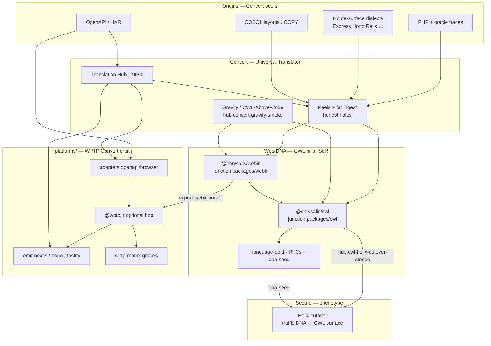

# Convert — whole system (nothing wasted)

**Status:** operator map for Convert after Rosetta Steps 1–4 and WPTP orbit cohesion  
**Lane:** `engines/chrysalis-convert` only — CWL owns DNA; Secure owns Helix; `platforms/wptp-*` are Convert’s optional orbit  
**Mission:** **Translate every honest web stack into WebIR/CWL** so the industry can share **web DNA** — not invent façades, not replace CWL.

This page is the picture of **how to use all the work** (PHP oracle, Hub, dialect peels, COBOL, WPTP platforms, CWL pin, Helix cutover) without treating any of it as a rival north star.

---

## 1. One picture



**Reading order:** origins → Convert peels/Hub → **CWL/WebIR DNA** → optional WPTP orbit for Next/matrix → Secure checks live DNA against that surface.

---

## 2. What each body of work is *for* (not wasted)

| Work we built | Keeps paying rent as… | Do not treat as… |
| --- | --- | --- |
| **PHP oracle + verify + chimera** | Reference **truth loop** (running app = spec) | The only origin forever |
| **WebIR + CWL golds + pin** | **DNA** Convert must land and consume | Something Convert redefines |
| **Dialect peels (20/20 golds)** | **Ingress** — more stacks → DNA | Product north star / bingo queue |
| **COBOL layout / COPY peels** | Dual-primary **hard origin** for enterprise | Replacement for web DNA |
| **Translation Hub** | Operator surface to run peels + contracts | A second IR language |
| **`platforms/wptp-*`** | **Orbit:** contract→IR→Next/matrix evidence | Second Rosetta / DNA SoR |
| **Hole Type System + dispose** | Honesty law when translation fails | License to invent |
| **Helix cutover smoke** | Prove DNA is **live-checkable** | Firewall features inside Convert |
| **WISP / products** | POC / customer proof | Default build |

---

## 3. Three ways to use Convert (pick by job)

### A — Feed web DNA (default “build”)

Goal: honest **origin → WebIR/CWL**.

```powershell
pnpm run link:cwl-packages-from-cwl
pnpm run hub:cwl-pin-smoke
pnpm run hub:convert-gravity-smoke
# then dual primary: COBOL residual OR one dialect deepen — no invent
```

Docs: [`CONVERT-GRAVITY.md`](./CONVERT-GRAVITY.md) · [`CONVERT-CWL-CONSUME.md`](./CONVERT-CWL-CONSUME.md) · [`UNIVERSAL-TRANSLATOR-CANON.md`](./UNIVERSAL-TRANSLATOR-CANON.md) · STRATEGY §12 dual primary.

### B — Contract / Next / matrix (WPTP orbit)

Goal: OpenAPI/HAR or Next emit / graded edges — **still through WebIR**, DNA stays CWL.

```powershell
pnpm run hub:wptp-orbit-smoke          # platforms/ siblings + junctions
pnpm run hub:install-wptp              # build emit-nextjs + matrix if needed
pnpm run hub:wptp-gold-smoke           # when siblings present
# or CHRYSALIS_SKIP_WPTP=1 for honest skip
```

Docs: [`WPTP-CONVERT-ORBIT.md`](./WPTP-CONVERT-ORBIT.md) · [`MULTI-REPO-WORKSPACE.md`](./MULTI-REPO-WORKSPACE.md) · `platforms/*`.

### C — Live match (with Secure)

Goal: authored CWL surface ⊆ traffic DNA.

```powershell
pnpm run hub:cwl-helix-cutover-smoke
# Secure: cutover-smoke / gce-sync — not Convert’s Helix core
```

Docs: CWL RFC-0022/0023 · umbrella `UT-CONVERT-SECURE-SPINE.md`.

---

## 4. Disk map (this machine)

```text
AgenticOps/
  engines/chrysalis-cwl/          ← DNA SoR (do not fork here from Convert)
  engines/chrysalis-convert/      ← THIS repo — peels, Hub, gravity, WPTP glue
  engines/chrysalis-security/     ← Helix
  platforms/wptp-ir|matrix|emit-*|adapter-*   ← Convert orbit (prefer over engines/wptp-*)
  products/wisptools|…            ← POC proof, not default queue
```

Junctions (gitignored — recreate with `pnpm run link:cwl-packages-from-cwl`):

- `packages/cwl` → CWL `@chrysalis/cwl`
- `packages/webir` → CWL `@chrysalis/webir`
- `packages/runtime-cwl*` / `emit-runtime-cwl` → CWL runtimes

**Hazard:** never `git rm` through those junctions on Windows (deletes into CWL).

---

## 5. Cohesion gates (green = system still wired)

| Gate | Token / meaning |
| --- | --- |
| `hub:cwl-pin-smoke` | Tip pin + package surface |
| `hub:convert-gravity-smoke` | Rosetta Step 2 Translation |
| `hub:cwl-language-pillar-smoke` | CWL golds reachable |
| `hub:cwl-helix-cutover-smoke` | Secure spine consume |
| `hub:wptp-orbit-smoke` | `platforms/` + junctions + orbit doc |
| `hub:agent-era-substrate-smoke` | Holes + CWL-Above-Code + dispose |

Skip orbit without shame: `CHRYSALIS_SKIP_WPTP=1`.

---

## 6. Anti-patterns (how we got off track — don’t repeat)

| Anti-pattern | Instead |
| --- | --- |
| Grow **IR-v0** as a second DNA | Land **CWL/WebIR**; use `@wptp/ir` only as orbit hop |
| Dialect bingo as default build | Dual primary: COBOL **or** one deepen; rest stay catalogued holes |
| Edit CWL grammar in Convert | Edit `chrysalis-cwl`, then junctions / pin |
| Treat WISP/Hub chrome as product | POC / operator surface only |
| Maintain `engines/wptp-*` and `platforms/wptp-*` | Prefer **`platforms/`** only |

---

## 7. Related

| Doc | Role |
| --- | --- |
| [`WPTP-CONVERT-ORBIT.md`](./WPTP-CONVERT-ORBIT.md) | platforms/ resolver + Hub entrypoints |
| [`CONVERT-GRAVITY.md`](./CONVERT-GRAVITY.md) | Step 2 closed proof |
| [`CORE-VS-PEEL.md`](./CORE-VS-PEEL.md) | What may live outside typed core |
| [`MASTER-PROGRAM.md`](./MASTER-PROGRAM.md) | Historical WPTP charter (D1+siblings) |
| [`PAUSED-AND-MAINTENANCE.md`](./PAUSED-AND-MAINTENANCE.md) | What is not default |
| CWL [`ROSETTA-UT-PATH.md`](../../chrysalis-cwl/docs/language/ROSETTA-UT-PATH.md) | Path Steps 1–6 |

**Bottom line:** Every peel, oracle, Hub path, COBOL layout, and `platforms/` repo was built to **push meaning toward a shared web model**. That model is now **CWL ↔ WebIR**. Convert’s job is to **keep filling it honestly**; WPTP keeps **serving Hub/Next/matrix**; nothing in that history needs to be thrown away — only aimed.
