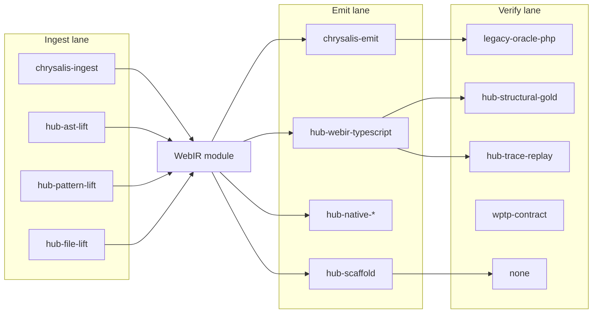

# Translation Hub — paths between web languages

Chrysalis does **not** implement twenty-one independent PHP-style ingests. Every hub pair shares one **WebIR** spine and differs only in **how source enters IR**, **how IR leaves**, and **what proves correctness**.

This document is the human view of the machine-readable matrix. For **similarities, differences, and best practices** on every pair, see **[HUB-PATH-KNOWLEDGE.md](./HUB-PATH-KNOWLEDGE.md)**.

- **CLI:** `pnpm run hub:path-matrix` (lanes/steps) · `pnpm run hub:path-knowledge` (full knowledge DB)
- **API:** `GET /api/hub/translation-path-matrix` · `GET /api/hub/path-knowledge`
- **Code:** `scripts/hub-ingest/hub-translation-paths.mjs` · `scripts/hub-ingest/hub-path-knowledge.mjs`

---

## The shared spine

**WebIR** is the only IR the hub promises between languages. Emit backends must not bypass it.

---

## Ingest lanes (by origin language)

| Lane | Origins | Mechanism |
| --- | --- | --- |
| **chrysalis-ingest** | `php` | `@chrysalis/ingest` + parser bridge → WebIR with full semantic lowering where supported |
| **hub-ast-lift** | `javascript`, `typescript`, `python`, `java`, `go` | Language-specific AST or pattern parsers (`*-ast-ingest.mjs`) |
| **hub-pattern-lift** | `ruby`, `csharp`, `kotlin`, `rust`, `scala`, `swift`, `vue`, `cobol`, … | Framework / language route patterns (`pattern-route-lift.mjs`; COBOL = PROGRAM-ID + optional `chrysalis-route` annotations) |
| **hub-file-lift** | `sql`, `html`, `css`, `json`, `yaml`, `markdown`, `c`, `cpp`, … | One GET route per scanned asset file |

Dispatcher: `hub-lift-dispatch.mjs` → `trySpecializedHubLift` before generic `lift-to-webir.mjs`.

---

## Emit lanes (by output language)

| Lane | Outputs | Script / package |
| --- | --- | --- |
| **chrysalis-emit** | PHP → `typescript` / `hono` / `fastify` (gold) | `chrysalis ingest` + `chrysalis emit` |
| **hub-webir-typescript** | `typescript`, `hono`, `fastify`, `nextjs` | `emit-from-hub.mjs`, `emit-nextjs-from-hub.mjs` |
| **hub-native-python** | `python` | `emit-python-from-hub.mjs` (Flask) |
| **hub-native-java** | `java` | `emit-java-from-hub.mjs` (Spring) |
| **hub-native-go** | `go` | `emit-go-from-hub.mjs` (gin) |
| **hub-native-ruby** | `ruby` | `emit-ruby-from-hub.mjs` (Sinatra) |
| **hub-native-csharp** | `csharp` | `emit-csharp-from-hub.mjs` (ASP.NET) |
| **hub-native-rust** | `rust` | `emit-rust-from-hub.mjs` (actix-web) |
| **hub-native-kotlin** | `kotlin` | `emit-kotlin-from-hub.mjs` (Ktor) |
| **hub-native-scala** | `scala` | `emit-scala-from-hub.mjs` (Akka HTTP) |
| **hub-native-swift** | `swift` | `emit-swift-from-hub.mjs` (Vapor) |
| **hub-scaffold** | Most other output cells | `wptp-emit-pipeline.mjs` with explicit hole `hub:emit-scaffold-fallback` |

Orchestrator for a project: `hub-translate.mjs` (PHP delegates to Chrysalis CLI; others lift then emit).

---

## Verify lanes (what “gold” means)

Oracle here means **spec + replay**, not “another ingest package.”

| Lane | When it applies | What runs |
| --- | --- | --- |
| **legacy-oracle-php** | PHP → TS/Hono/Fastify, grade **gold** | Capture on origin (`oracle-php`), `chrysalis verify`, flagship corpora |
| **hub-structural-gold** | JS/TS/python literal → Hono/Fastify, grade **gold** | `hub-gold-verify.mjs` + `hub-gold-manifest.mjs` suites |
| **hub-trace-replay** | Literal suites → Hono/Fastify, grade **gold** | `hub-gold-trace-replay.mjs` (`@chrysalis/verify` in-process) |
| **oracle-python** / **oracle-node** | Capture on legacy Python/Node hosts | `packages/oracle-python`, `packages/oracle-node`, `hub-oracle-record.mjs` (`--base-url`, `--routes` for live Node/Express) |
| **wptp-contract** | OpenAPI/Swagger/HAR in tree → framework outputs | `wptp-compose-site.mjs`, `hub:wptp-gold-smoke` (alternate path; any origin) |
| **none** | Silver/open pairs | Holes documented; no trace parity claimed |

**Wrong approach:** clone `@chrysalis/ingest` per language in the hub.

**Right approach:** widen lowering, add per-origin trace recorders when needed, promote pairs via the lanes above.

---

## Contract-first alternate (any origin)

When a site tree contains **OpenAPI**, **Swagger**, or **HAR**, the hub can skip native ingest:

1. `discoverContractArtifacts` (G20)
2. `wptp-compose-site.mjs` / `wptp-emit-pipeline.mjs`
3. Emit **hono** or **nextjs** from contract IR
4. Verify via **wptp-contract** harness when `wptp-matrix` is present

This is an **alternate** path on the same pair row, not a different matrix cell.

---

## Route grades vs paths

| Grade | Meaning |
| --- | --- |
| **gold** | Runnable route + CI-backed verify lane (PHP oracle or hub gold fixtures) |
| **silver** | Runnable lift + real or native emit; bodies often holes; verify **none** |
| **open** | Runnable scaffold; native emitter missing or PHP→non-TS tail |

Grades live on `HUB_ROUTES` in `chrysalis-hub-store.mjs`. Paths explain **how** each grade is achieved today and **what to build** to promote (`promoteToGold` in path JSON).

Grid (23 origins × 26 outputs, minus identity): **575** directed pairs — run `pnpm run hub:completion` for current gold/silver/open counts.

---

## Examples

### PHP → Hono (gold)

1. **Ingest:** `chrysalis-ingest` (optional `oracle-php` capture on origin)
2. **IR:** WebIR module under `.chrysalis/`
3. **Emit:** `chrysalis-emit` → `generated/hono`
4. **Verify:** `legacy-oracle-php` + `chrysalis verify`

### Python → Java (silver)

1. **Ingest:** `hub-ast-lift` (`python-ast-ingest.mjs`)
2. **IR:** WebIR routes (dict/call bodies → holes)
3. **Emit:** `hub-native-java` (`emit-java-from-hub.mjs`)
4. **Verify:** `none` (promote with trace-backed replay, not a Python ingest clone)

### JavaScript → Hono (gold, literal fixture)

1. **Ingest:** `hub-ast-lift` (literal `res.json` lowered)
2. **Emit:** `hub-webir-typescript`
3. **Verify:** `hub-structural-gold` + `hub-trace-replay`

### Python → Hono (gold, literal fixture, G30)

1. **Ingest:** `hub-ast-lift` (bool/int literal returns; simple dict literals)
2. **Emit:** `hub-webir-typescript`
3. **Verify:** `hub-structural-gold` + `hub-trace-replay` (suite `python-literal-hono`)

### Kotlin / Scala / Swift → native (silver, G30)

1. **Ingest:** `hub-pattern-lift`
2. **Emit:** `hub-native-kotlin` | `hub-native-scala` | `hub-native-swift`
3. **Verify:** `none` (promote with trace recorder + replay)

CI aggregates: `pnpm run ci:hub-completion` (matrix smoke, gold suites, trace replay, native emit smoke, oracle recorder smoke).

---

## Operator surfaces

| Surface | Path data |
| --- | --- |
| Languages tab / readiness API | Each pair includes `ingestLane`, `emitLane`, `verifyLanes` |
| Path matrix API | Full `steps`, `prerequisites`, `alternates`, `promoteToGold` |
| Work queue | Tasks derived from grades + origin/output readiness rows |

See also [HUB-CONNECTIVITY.md](./HUB-CONNECTIVITY.md) for SSH, capture, and hub VM setup.
