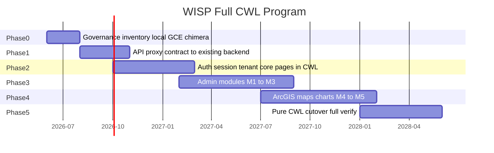

# WISP Module_Manager — full CWL reference POC (Phase 12–13)

> **Role:** **Important POC** — not the north star. The north star is **CWL** ([`CWL-SURFACE-TAXONOMY.md`](./CWL-SURFACE-TAXONOMY.md)). WISP proves surface waves on a real app; wins here must **generalize** to other migrations.  
> **Status:** active — **Phase 0 closed** (2026-06-19, **G6310**); **Phase 13 closed** (2026-06-19, **G6410**)  
> **Queue:** **G6300–G6310** closed; **G6340–G6420** Phase 13 surfaces **closed**
> **Template app:** [AgenticOp-io/WISP-Management](https://github.com/AgenticOp-io/WISP-Management) `Module_Manager/`  
> **Local path (operator):** `C:\Users\david\Downloads\WISPTools\Module_Manager`  
> **Authority:** STRATEGIC-PLAN §13 amendment 2026-06-19 — **DESIGN D6192**

WISP is the **reference full-stack CWL migration** for the **Module_Manager UI layer**: SvelteKit → CWL + chimera gateway, with **existing backend APIs left as-is** (Express/MongoDB/GenieACS on `acs-hss-server`). Goal: express as many WISP UI scenarios as exist in code in CWL; **proxy** `/api/*` to the live backend — do not replatform or convert the backend in this program unless explicitly amended later.

**Phase 0 close (G6310):** governance, 87 UI routes + API proxy contract, chimera gateway, dual deploy scripts, hole manifest, scenario inventory — verified `pnpm run hub:wisp-cwl-phase12-phase0-close-smoke`.

**Phase 13 close (G6410):** M0→M6 surface waves — Pages, Data, UI holes, and **CWL Effects** (`session.read` on protected routes) — verified `pnpm run hub:wisp-cwl-phase13-close-smoke`. **Default build:** maintenance per [`PAUSED-AND-MAINTENANCE.md`](./PAUSED-AND-MAINTENANCE.md).

## Definition of done (program close G6310)

| Tier | Criterion |
| --- | --- |
| T1 | 87 UI routes + all `/api/*` paths in signed CWL contract |
| T2 | Runnable on GCE chimera/CWL entry (no silent 501 for in-scope API) |
| T3 | Data-backed via **proxy to existing backend** (no backend rewrite) |
| T4 | Auth + tenant headers on API proxy |
| T5 | ArcGIS / Firebase / chart client scenarios catalogued + chimera or CWL client bundle |
| T6 | Trace verify ≥99% vs reference stack |

**Today (Phase 0):** T1 partial (87 UI, API manifest); T2 chimera gateway; T3–T6 planned.

## Topology and deploy

**Convert the Module_Manager UI to CWL; leave the backend as-is.**

The WISP backend on `acs-hss-server` includes Express (`backend-services`), MongoDB, **GenieACS**, HSS integrations, and related ops tooling. That stack is **not** replatformed during Phase 12. The chimera gateway **proxies** `/api/*` (and `/admin` where needed) to the operator backend.

```text
                    ┌──────────────────────────────────────┐
  Browser ────────► │  VM A: chrysalis-test-vm (we deploy) │
                    │  :19100  wisp-cwl-chimera-gateway    │
                    │    ├─ CWL runtime (lifted @page)     │
                    │    ├─ /api/* → proxy ────────────────┼──► existing backend
                    │    └─ holed UI → SvelteKit :3000     │    (acs-hss-server)
                    └──────────────────────────────────────┘
                              unchanged operator stack:
                    ┌──────────────────────────────────────┐
                    │  acs-hss-server                       │
                    │  backend-services :3001 (nginx :443)  │
                    │  MongoDB, GenieACS binaries, etc.     │
                    └──────────────────────────────────────┘
```

| Layer | Role | Notes |
| --- | --- | --- |
| **chrysalis-test-vm** (front) | CWL + chimera gateway, optional SvelteKit fallback | `:19100` — we deploy this |
| **acs-hss-server** (backend) | **Unchanged** — `backend-services`, MongoDB, GenieACS | Proxy target only |

**Chimera backend URL:** `https://hss.wisptools.io` (nginx → `:3001`). Do **not** use `https://hss.wisptools.io:3001` — port 3001 is plain HTTP.

| Variable (VM A) | Purpose |
| --- | --- |
| `WISP_BACKEND_URL` | Backend base, default `https://hss.wisptools.io` |
| `WISP_SVELTE_FALLBACK` | SvelteKit on `:3000` for holed UI routes |
| `WISP_CWL_PORT` | `19100` |

### Dual deploy (Firebase + GCE)

| Target | Entry | Client build | Deploy |
| --- | --- | --- | --- |
| **Firebase Hosting** | `management.wisptools.io` | `wisp:build:client:firebase` | `wisp:deploy:firebase` |
| **GCE chimera lab** | `chrysalis-test-vm` `:19100` | `wisp:build:client:gce` + sidecar | `wisp:deploy:gce` |

GCE sidecar uses `VITE_CHRYSALIS_SAME_ORIGIN_API=1` (same-origin `/api/*` via chimera). Firebase uses Hosting rewrites → `apiProxy`. Config: `fixtures/hub-wisp-management/wisp-pipeline.config.json`.

CWL `@page` routes (e.g. `/docs`) run on **GCE chimera** via `runtime-cwl`. Firebase serves the full SvelteKit SPA until later phases export static CWL pages.

### Verify

- CWL static pages: `GET /docs` → 200 from CWL
- API proxy: `GET /api/tenants` → forwarded to backend (401/200 with auth; not 502)
- UI fallback: `GET /login` → SvelteKit when sidecar set
- Inventory: `pnpm run wisp:scenario-inventory`

## Phase 0 deliverables (G6300–G6304)

| ID | Gate | Smoke |
| --- | --- | --- |
| G6300 | `runWispCwlProgramDocGate` | doc references |
| G6301 | `runWispCwlApiPathsManifestGate` | `fixtures/hub-wisp-management/wisp-api-paths.json` |
| G6302 | `runWispCwlScenarioInventoryGate` | `pnpm run wisp:scenario-inventory` |
| G6303 | `runWispCwlChimeraGatewaySmokeGate` | `pnpm run wisp:chimera-gateway-smoke` |
| G6304 | `runWispCwlPhase12Phase0EntryGate` | `pnpm run hub:wisp-cwl-phase12-phase0-entry-smoke` |
| G6320 | `runWispCwlPipelineSmokeGate` | `pnpm run hub:wisp-cwl-pipeline-smoke` |
| G6330 | `runWispCwlDualDeployConfigSmokeGate` | `pnpm run hub:wisp-cwl-dual-deploy-config-smoke` |

### Phase 0 close (G6305–G6310)

| ID | Gate | Smoke |
| --- | --- | --- |
| G6305 | `runWispCwlHoleManifestGate` | `pnpm run wisp:hole-manifest` |
| G6306 | `runWispCwlRoutesFixtureGate` | 87 UI routes in `routes.cwl` + preview |
| G6307 | `runWispCwlTopologyDocGate` | deploy topology section in this doc |
| G6308 | `runWispCwlBackendDeferralGate` | Mongo + GenieACS `backendConversion: deferred` |
| G6309 | `runWispCwlDeployScriptsGate` | chimera gateway + GCE deploy scripts |
| G6310 | `runWispCwlPhase12Phase0CloseGate` | `pnpm run hub:wisp-cwl-phase12-phase0-close-smoke` |

### Phase 0 artifacts

- `fixtures/hub-wisp-management/` — API paths, hole budget, scenario manifest v1
- `scripts/wisp-cwl-scenario-inventory.mjs` — scans WISP tree for integration scenarios
- `scripts/wisp-cwl-generate-api-proxy-cwl.mjs` — CWL `@route` proxy contract for `/api/*`
- `scripts/wisp-cwl-chimera-gateway.mjs` — CWL UI + `/api` backend proxy + SvelteKit fallback
- `scripts/wisp-cwl-hole-manifest.mjs` — UI hole manifest v1 + API contract counts
- `scripts/wisp-cwl-pipeline.mjs` — automated build + gates + optional GCE deploy + report
- `scripts/gce-wisp-local-stack-deploy.ps1` / `.sh` — front VM deploy (backend unchanged)

## Scenario matrix (WISP code → CWL)

| Scenario | WISP location | Phase | CWL / hole |
| --- | --- | --- | --- |
| Static docs pages | `src/routes/docs/*` | 0 | `@page` + html |
| Interactive pages | 78× `+page.svelte` | 2+ | `hub-svelte:page-component` |
| Firebase auth | `authService`, `login/+page.svelte` | 1–2 | `hub-svelte:firebase-auth` |
| Tenant guard | `TenantGuard.svelte`, `+layout.svelte` | 2 | session + guard |
| API JWT + X-Tenant-ID | `apiService.ts` | 1 | CWL upstream proxy + session |
| MongoDB REST | `backend-services/routes/*` | 1 | `hub-cwl:upstream-proxy` → **existing** backend (no CWL backend conversion) |
| GenieACS / TR-069 | `genieacs-fork`, ACS module | — | **Out of scope** — backend binaries stay on operator VM |
| ArcGIS MapView | `arcgisMapController.ts` | 4 | `hub-svelte:arcgis-map` |
| SharedMap iframe | `SharedMap.svelte` | 4 | `hub-svelte:cross-frame-messaging` |
| Geocoding | `plan/+page.svelte` | 4 | upstream or geocode proxy |
| echarts / vis-network | monitor modules | 4 | `hub-svelte:chart-component` |
| Stripe billing | billing module | 3 | explicit hole + API proxy |

## Phased timeline



## Module waves (21 modules) — Phase 13 surface mapping

Named surfaces: [`CWL-SURFACE-TAXONOMY.md`](./CWL-SURFACE-TAXONOMY.md) (**D6193**).

| Wave | Modules | Primary surfaces | Close criterion |
| --- | --- | --- | --- |
| M0 | docs, help, login | **Pages**, then **UI** | `/docs` native `@page`; login hole → CWL UI RFC |
| M1 | dashboard | **Data**, **UI**, **API** | Tenant context in `load`; widgets = UI holes |
| M2 | admin, customers | **API**, **UI** | Admin routes in proxy contract + UI lift |
| M3 | plan, deploy, coverage-map | **UI**, **Data**, **API** | ArcGIS = client hole until CWL UI policy |
| M4 | acs, hss, monitor | **API**, **UI** | GenieACS stays backend; TR-069 via API surface |
| M5 | remainder | All surfaces | Pure CWL cutover + trace verify ≥99% |

M0 docs/help/login → M1 dashboard → M2 admin/customers → M3 plan/deploy/coverage-map → M4 acs/hss/monitor → M5 remainder.

### Phase 13 gates

| ID | Gate | Smoke |
| --- | --- | --- |
| G6340 | `runCwlSurfaceTaxonomyDocGate` | `pnpm run hub:cwl-surface-taxonomy-smoke` |
| **G6350 M0** | `runWispCwlPhase13M0Gate` | `pnpm run hub:wisp-cwl-phase13-m0-smoke` |
| **G6360 M1** | `runWispCwlPhase13M1Gate` | `pnpm run hub:wisp-cwl-phase13-m1-smoke` |
| **G6370 M2** | `runWispCwlPhase13M2Gate` | `pnpm run hub:wisp-cwl-phase13-m2-smoke` |
| **G6380 M3** | `runWispCwlPhase13M3Gate` | `pnpm run hub:wisp-cwl-phase13-m3-smoke` |
| **G6390 M4** | `runWispCwlPhase13M4Gate` | `pnpm run hub:wisp-cwl-phase13-m4-smoke` |
| **G6400 M5** | `runWispCwlPhase13M5Gate` | `pnpm run hub:wisp-cwl-phase13-m5-smoke` |
| **G6410 close** | `runWispCwlPhase13CloseGate` | `pnpm run hub:wisp-cwl-phase13-close-smoke` |
| **G6420 M6** | `runWispCwlPhase13M6Gate` | `pnpm run hub:wisp-cwl-phase13-m6-smoke` |

**M0 shipped (G6350):** native `@page` for `/docs/*` (incl. project-status) and `/help`; `/login` → `hub-svelte:firebase-auth` UI hole (CWL-RFC-0012).

**M1 shipped (G6360):** `/dashboard` `@page` + **`load { tenantLabel, … }`** (CWL Data); widget catalog as UI holes. Apply after lift: `pnpm run wisp:apply-phase13-surfaces`.

**M2 shipped (G6370):** Admin routes + `/modules/customers` `@page` + **`load { adminArea | module, … }`**; `/api/admin` + `/api/customers` API surface verified in proxy contract; portal sub-routes remain UI holes.

**M3 shipped (G6380):** Plan, deploy, coverage-map `@page` + **`load { module, apiPath, … }`**; API surfaces `/api/plans`, `/api/deploy`, `/api/network`; ArcGIS MapView/geocode as **`hub-svelte:arcgis-map`** client holes (not lowered in runtime-cwl).

**M4 shipped (G6390):** ACS (GenieACS TR-069 proxy), HSS, SNMP monitoring — **`@page` + `load`** on 13 routes; **`/api/device-assignment`**, **`/api/hss`**, **`/api/monitoring`**, **`/api/snmp`** verified.

**M5 shipped (G6400):** Remaining UI routes lifted to **`@page` + `load`**; **≥99%** native page ratio; **`/login`** only UI hole (`hub-svelte:firebase-auth`); chimera serves all non-API paths from CWL when **`WISP_CWL_NATIVE_PREFIXES=*`**.

**M6 shipped (G6420):** **CWL Effects** — **`effects: session.read`** on M1–M2 protected routes (dashboard, admin, customers, tenant ops); declarative RFC-0007 metadata; auth enforcement stays upstream (Firebase/chimera).

**Phase 13 close (G6410):** M0–M6 gates green + taxonomy + single login UI hole. Regression: `pnpm run hub:wisp-cwl-phase13-close-smoke`.

## Operator commands

### One-command automation

| Command | When |
| --- | --- |
| `pnpm run wisp:pipeline` | Local: lift (if WISP root present) + G6310 gates + report |
| `pnpm run wisp:pipeline:ci` | CI: fixtures only, no lift, no GCE |
| `pnpm run wisp:deploy:gce` | Full pipeline + deploy chimera to `chrysalis-test-vm` + remote verify |
| `pnpm run wisp:deploy:firebase` | Build Firebase client profile + `firebase deploy --only hosting:management` |
| `pnpm run wisp:deploy:both` | Pipeline + deploy to GCE and Firebase (when credentials available) |
| `pnpm run wisp:build:client:gce` | GCE sidecar client only (`VITE_CHRYSALIS_SAME_ORIGIN_API=1`) |
| `pnpm run wisp:build:client:firebase` | Firebase Hosting client only |
| `pnpm run hub:wisp-cwl-pipeline-smoke` | **G6320** — same as `wisp:pipeline:ci`, writes `reports/wisp/wisp-cwl-pipeline.json` |
| `pnpm run hub:wisp-cwl-dual-deploy-config-smoke` | **G6330** — dual deploy profile/config gate |

Config defaults: `fixtures/hub-wisp-management/wisp-pipeline.config.json`. Override via env:

- `CHRYSALIS_WISP_ROOT` — WISP Module_Manager path
- `CHRYSALIS_WISP_DEPLOY_GCE=1` — enable GCE deploy step
- `CHRYSALIS_WISP_DEPLOY_FIREBASE=1` — enable Firebase deploy step
- `CHRYSALIS_WISP_FIREBASE_PROJECT` — override Firebase project (default `wisptools-production`)
- `CHRYSALIS_WISP_GCE_PROJECT`, `CHRYSALIS_WISP_BACKEND_URL`

GitHub Actions: **CI** runs `hub:wisp-cwl-pipeline-smoke` on every PR. **Deploy** uses workflow `wisp-cwl-gce-deploy.yml` (manual dispatch; requires `GCP_CHRYSALIS_DEPLOY_KEY` secret).

```powershell
# Phase 0 — full build + smokes
pnpm run wisp:pipeline
pnpm run hub:wisp-cwl-phase12-phase0-close-smoke

# Or step-by-step
pnpm run wisp:scenario-inventory
pnpm run wisp:generate-api-proxy-cwl
pnpm run wisp:chimera-gateway-smoke

# GCE front VM (chimera + CWL bundle)
powershell -ExecutionPolicy Bypass -File .\scripts\gce-wisp-local-stack-deploy.ps1 -Project chrysalis-dev-f5x6qv

# Veracity probe
node scripts/wisp-cwl-poc-verify.mjs --base-url http://34.61.255.147:19100 --preview fixtures/hub-wisp-management/cwl-preview.json
```

## Non-goals (Phase 0–12 unless amended)

- Pure CWL UI for all 87 routes (Phase 2+)
- ArcGIS lowering inside `runtime-cwl` simulation
- Replacing MongoDB with SQL in Chrysalis engine
- **Backend / GenieACS conversion to CWL** — deferred; chimera proxies to existing APIs
- Replatforming GenieACS or Mongo onto `chrysalis-test-vm`

## Related

- [`CWL-SURFACE-TAXONOMY.md`](./CWL-SURFACE-TAXONOMY.md) — named surfaces (API, Pages, Data, UI, Effects)
- [`CWL-FULLSTACK-SCOPE-RFC.md`](./CWL-FULLSTACK-SCOPE-RFC.md) — component holes policy
- [`CWL.md`](./CWL.md) — CWL API (`@route`) vs Pages (`@page`) syntax
