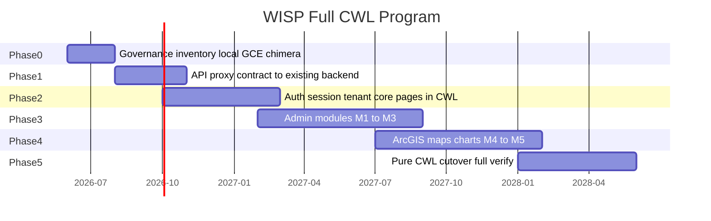

# WISP Module_Manager — full CWL reference POC (Phase 12–13)

> **Role:** **Important POC** — not the north star. The north star is **CWL** ([`CWL-SURFACE-TAXONOMY.md`](./CWL-SURFACE-TAXONOMY.md)). WISP proves surface waves on a real app; wins here must **generalize** to other migrations.  
> **Status:** **maintenance** — **Phase 0 closed** (2026-06-19, **G6310**); **Phase 13 closed** (2026-06-19, **G6410**); **Phase 14 closed** (2026-06-19, **G6690**)  
> **Queue:** **G6300–G6420** closed; **G6500–G6700** closed; **CWL language:** maintenance per [`PAUSED-AND-MAINTENANCE.md`](./PAUSED-AND-MAINTENANCE.md)  
> **Template app:** [AgenticOp-io/WISP-Management](https://github.com/AgenticOp-io/WISP-Management) `Module_Manager/`  
> **Local path (operator):** `C:\Users\david\Downloads\WISPTools\Module_Manager`  
> **Authority:** STRATEGIC-PLAN §13 amendment 2026-06-19 — **DESIGN D6192**

WISP is the **reference full-stack CWL migration** for the **Module_Manager UI layer**: SvelteKit → CWL + chimera gateway, with **existing backend APIs left as-is** (Express/MongoDB/GenieACS on `acs-hss-server`). Goal: express as many WISP UI scenarios as exist in code in CWL; **proxy** `/api/*` to the live backend — do not replatform or convert the backend in this program unless explicitly amended later.

**Phase 0 close (G6310):** governance, 87 UI routes + API proxy contract, chimera gateway, dual deploy scripts, hole manifest, scenario inventory — verified `pnpm run hub:wisp-cwl-phase12-phase0-close-smoke`.

**Phase 13 close (G6410):** M0→M6 surface waves — Pages, Data, UI holes, and **CWL Effects** (`session.read` on protected routes) — verified `pnpm run hub:wisp-cwl-phase13-close-smoke`.

**Phase 14 close (G6690):** HSS operator deploy archived — chimera demo on GCE, proxy to `https://hss.wisptools.io`, client redirects, remote verify. Regression: `pnpm run hub:wisp-cwl-phase14-program-close-smoke` and `pnpm run hub:wisp-cwl-phase14-close-smoke` (**G6590**).

**Phase 14 (closed — operator):** Refresh **HSS site** deploy (chimera/CWL front → `https://hss.wisptools.io` proxy). **ACS / GenieACS / TR-069** remain **operator infra** on `acs-hss-server` — **not** CWL language goals (**DESIGN D6204**). Default CWL build: maintenance per [`PAUSED-AND-MAINTENANCE.md`](./PAUSED-AND-MAINTENANCE.md).

## Definition of done (program close G6310)

| Tier | Criterion |
| --- | --- |
| T1 | 87 UI routes + all `/api/*` paths in signed CWL contract |
| T2 | Runnable on GCE chimera/CWL entry (no silent 501 for in-scope API) |
| T3 | Data-backed via **proxy to existing backend** (no backend rewrite) |
| T4 | Auth + tenant headers on API proxy |
| T5 | ArcGIS / Firebase / chart client scenarios catalogued + chimera or CWL client bundle |
| T6 | Trace verify ≥99% vs reference stack |

**Today (Phase 0):** T1 partial (87 UI, API manifest); T2 chimera gateway; T3–T6 planned.

## Topology and deploy

**Convert the Module_Manager UI to CWL where it generalizes; leave the HSS backend VM as-is.**

The **HSS GCE stack** (`acs-hss-server`, `https://hss.wisptools.io`) exists to run **operator backend services**: Express (`backend-services`), **MongoDB** (modernized in place), **GenieACS** (TR-069 binaries), and HSS integrations. That VM is **infra**, not a CWL migration target. Phase 14 **updates how the UI reaches** this stack (chimera proxy, deploy, health) — it does **not** convert GenieACS or Mongo into CWL.

The chimera gateway **proxies** `/api/*` to the operator backend. ACS CPE UI may remain **Svelte sidecar** or static CWL shells (Phase 13 M4 regression fixtures only) — **no further ACS depth** in the language program.

```text
                    ┌──────────────────────────────────────┐
  Browser ────────► │  VM A: chrysalis-test-vm (we deploy) │
                    │  :19100  wisp-cwl-chimera-gateway    │
                    │    ├─ CWL runtime (lifted @page)     │
                    │    ├─ /api/* → proxy ────────────────┼──► existing backend
                    │    └─ holed UI → SvelteKit :3000     │    (acs-hss-server)
                    └──────────────────────────────────────┘
                              unchanged operator stack:
                    ┌──────────────────────────────────────┐
                    │  acs-hss-server                       │
                    │  backend-services :3001 (nginx :443)  │
                    │  MongoDB, GenieACS binaries, etc.     │
                    └──────────────────────────────────────┘
```

| Layer | Role | Notes |
| --- | --- | --- |
| **chrysalis-test-vm** (front) | CWL + chimera gateway, optional SvelteKit fallback | `:19100` — we deploy this |
| **acs-hss-server** (HSS backend VM) | **Unchanged infra** — `backend-services`, MongoDB, **GenieACS** | Built to house GenieACS; proxy target only — **no CWL conversion** |

**Chimera backend URL:** `https://hss.wisptools.io` (nginx → `:3001`). Do **not** use `https://hss.wisptools.io:3001` — port 3001 is plain HTTP.

| Variable (VM A) | Purpose |
| --- | --- |
| `WISP_BACKEND_URL` | Backend base, default `https://hss.wisptools.io` |
| `WISP_SVELTE_FALLBACK` | SvelteKit on `:3000` for holed UI routes |
| `WISP_CWL_PORT` | `19100` |

### Dual deploy (Firebase + GCE)

| Target | Entry | Client build | Deploy |
| --- | --- | --- | --- |
| **Firebase Hosting** | `management.wisptools.io` | `wisp:build:client:firebase` | `wisp:deploy:firebase` |
| **GCE chimera lab** | `chrysalis-test-vm` `:19100` | `wisp:build:client:gce` + sidecar | `wisp:deploy:gce` |

GCE sidecar uses `VITE_CHRYSALIS_SAME_ORIGIN_API=1` (same-origin `/api/*` via chimera). Firebase uses Hosting rewrites → `apiProxy`. Config: `fixtures/hub-wisp-management/wisp-pipeline.config.json`.

CWL `@page` routes (e.g. `/docs`) run on **GCE chimera** via `runtime-cwl`. Firebase serves the full SvelteKit SPA until later phases export static CWL pages.

### Verify

- CWL static pages: `GET /docs` → 200 from CWL
- API proxy: `GET /api/tenants` → forwarded to backend (401/200 with auth; not 502)
- UI fallback: `GET /login` → SvelteKit when sidecar set
- Inventory: `pnpm run wisp:scenario-inventory`

## Phase 0 deliverables (G6300–G6304)

| ID | Gate | Smoke |
| --- | --- | --- |
| G6300 | `runWispCwlProgramDocGate` | doc references |
| G6301 | `runWispCwlApiPathsManifestGate` | `fixtures/hub-wisp-management/wisp-api-paths.json` |
| G6302 | `runWispCwlScenarioInventoryGate` | `pnpm run wisp:scenario-inventory` |
| G6303 | `runWispCwlChimeraGatewaySmokeGate` | `pnpm run wisp:chimera-gateway-smoke` |
| G6304 | `runWispCwlPhase12Phase0EntryGate` | `pnpm run hub:wisp-cwl-phase12-phase0-entry-smoke` |
| G6320 | `runWispCwlPipelineSmokeGate` | `pnpm run hub:wisp-cwl-pipeline-smoke` |
| G6330 | `runWispCwlDualDeployConfigSmokeGate` | `pnpm run hub:wisp-cwl-dual-deploy-config-smoke` |

### Phase 0 close (G6305–G6310)

| ID | Gate | Smoke |
| --- | --- | --- |
| G6305 | `runWispCwlHoleManifestGate` | `pnpm run wisp:hole-manifest` |
| G6306 | `runWispCwlRoutesFixtureGate` | 87 UI routes in `routes.cwl` + preview |
| G6307 | `runWispCwlTopologyDocGate` | deploy topology section in this doc |
| G6308 | `runWispCwlBackendDeferralGate` | Mongo + GenieACS `backendConversion: deferred` |
| G6309 | `runWispCwlDeployScriptsGate` | chimera gateway + GCE deploy scripts |
| G6310 | `runWispCwlPhase12Phase0CloseGate` | `pnpm run hub:wisp-cwl-phase12-phase0-close-smoke` |

### Phase 0 artifacts

- `fixtures/hub-wisp-management/` — API paths, hole budget, scenario manifest v1
- `scripts/wisp-cwl-scenario-inventory.mjs` — scans WISP tree for integration scenarios
- `scripts/wisp-cwl-generate-api-proxy-cwl.mjs` — CWL `@route` proxy contract for `/api/*`
- `scripts/wisp-cwl-chimera-gateway.mjs` — CWL UI + `/api` backend proxy + SvelteKit fallback
- `scripts/wisp-cwl-hole-manifest.mjs` — UI hole manifest v1 + API contract counts
- `scripts/wisp-cwl-pipeline.mjs` — automated build + gates + optional GCE deploy + report
- `scripts/gce-wisp-local-stack-deploy.ps1` / `.sh` — front VM deploy (backend unchanged)

## Scenario matrix (WISP code → CWL)

| Scenario | WISP location | Phase | CWL / hole |
| --- | --- | --- | --- |
| Static docs pages | `src/routes/docs/*` | 0 | `@page` + html |
| Interactive pages | 78× `+page.svelte` | 2+ | `hub-svelte:page-component` |
| Firebase auth | `authService`, `login/+page.svelte` | 1–2 | `hub-svelte:firebase-auth` |
| Tenant guard | `TenantGuard.svelte`, `+layout.svelte` | 2 | session + guard |
| API JWT + X-Tenant-ID | `apiService.ts` | 1 | CWL upstream proxy + session |
| MongoDB REST | `backend-services/routes/*` | 1 | `hub-cwl:upstream-proxy` → **existing** backend (no CWL backend conversion) |
| GenieACS / TR-069 | `genieacs-fork`, ACS module UI | — | **Operator-only** — binaries on HSS VM; **excluded from CWL depth** (D6204) |
| ACS CPE UI | `modules/acs-cpe-management/*` | 13 (regression) | M4 `@page` shells in fixtures only; **sidecar/proxy** — no widget lowering |
| ArcGIS MapView | `arcgisMapController.ts` | 4 | `hub-svelte:arcgis-map` |
| SharedMap iframe | `SharedMap.svelte` | 4 | `hub-svelte:cross-frame-messaging` |
| Geocoding | `plan/+page.svelte` | 4 | upstream or geocode proxy |
| echarts / vis-network | monitor modules | 4 | `hub-svelte:chart-component` |
| Stripe billing | billing module | 3 | explicit hole + API proxy |

## Phased timeline



## Module waves (21 modules) — Phase 13 surface mapping

Named surfaces: [`CWL-SURFACE-TAXONOMY.md`](./CWL-SURFACE-TAXONOMY.md) (**D6193**).

| Wave | Modules | Primary surfaces | Close criterion |
| --- | --- | --- | --- |
| M0 | docs, help, login | **Pages**, then **UI** | `/docs` native `@page`; login hole → CWL UI RFC |
| M1 | dashboard | **Data**, **UI**, **API** | Tenant context in `load`; widgets = UI holes |
| M2 | admin, customers | **API**, **UI** | Admin routes in proxy contract + UI lift |
| M3 | plan, deploy, coverage-map | **UI**, **Data**, **API** | ArcGIS = client hole until CWL UI policy |
| M4 | acs, hss, monitor | **API**, **UI** | GenieACS stays backend; TR-069 via API surface |
| M5 | remainder | All surfaces | Pure CWL cutover + trace verify ≥99% |

M0 docs/help/login → M1 dashboard → M2 admin/customers → M3 plan/deploy/coverage-map → M4 acs/hss/monitor → M5 remainder.

### Phase 13 gates

| ID | Gate | Smoke |
| --- | --- | --- |
| G6340 | `runCwlSurfaceTaxonomyDocGate` | `pnpm run hub:cwl-surface-taxonomy-smoke` |
| **G6350 M0** | `runWispCwlPhase13M0Gate` | `pnpm run hub:wisp-cwl-phase13-m0-smoke` |
| **G6360 M1** | `runWispCwlPhase13M1Gate` | `pnpm run hub:wisp-cwl-phase13-m1-smoke` |
| **G6370 M2** | `runWispCwlPhase13M2Gate` | `pnpm run hub:wisp-cwl-phase13-m2-smoke` |
| **G6380 M3** | `runWispCwlPhase13M3Gate` | `pnpm run hub:wisp-cwl-phase13-m3-smoke` |
| **G6390 M4** | `runWispCwlPhase13M4Gate` | `pnpm run hub:wisp-cwl-phase13-m4-smoke` |
| **G6400 M5** | `runWispCwlPhase13M5Gate` | `pnpm run hub:wisp-cwl-phase13-m5-smoke` |
| **G6410 close** | `runWispCwlPhase13CloseGate` | `pnpm run hub:wisp-cwl-phase13-close-smoke` |
| **G6420 M6** | `runWispCwlPhase13M6Gate` | `pnpm run hub:wisp-cwl-phase13-m6-smoke` |

**M0 shipped (G6350):** native `@page` for `/docs/*` (incl. project-status) and `/help`; `/login` → `hub-svelte:firebase-auth` UI hole (CWL-RFC-0012).

**M1 shipped (G6360):** `/dashboard` `@page` + **`load { tenantLabel, … }`** (CWL Data); widget catalog as UI holes. Apply after lift: `pnpm run wisp:apply-phase13-surfaces`.

**M2 shipped (G6370):** Admin routes + `/modules/customers` `@page` + **`load { adminArea | module, … }`**; `/api/admin` + `/api/customers` API surface verified in proxy contract; portal sub-routes remain UI holes.

**M3 shipped (G6380):** Plan, deploy, coverage-map `@page` + **`load { module, apiPath, … }`**; API surfaces `/api/plans`, `/api/deploy`, `/api/network`; ArcGIS MapView/geocode as **`hub-svelte:arcgis-map`** client holes (not lowered in runtime-cwl).

**M4 shipped (G6390):** ACS (GenieACS TR-069 proxy), HSS, SNMP monitoring — **`@page` + `load`** on 13 routes; **`/api/device-assignment`**, **`/api/hss`**, **`/api/monitoring`**, **`/api/snmp`** verified.

**M5 shipped (G6400):** Remaining UI routes lifted to **`@page` + `load`**; **≥99%** native page ratio; **`/login`** only UI hole (`hub-svelte:firebase-auth`); chimera serves all non-API paths from CWL when **`WISP_CWL_NATIVE_PREFIXES=*`**.

**M6 shipped (G6420):** **CWL Effects** — **`effects: session.read`** on M1–M2 protected routes (dashboard, admin, customers, tenant ops); declarative RFC-0007 metadata; auth enforcement stays upstream (Firebase/chimera).

**Phase 13 close (G6410):** M0–M6 gates green + taxonomy + single login UI hole. Regression: `pnpm run hub:wisp-cwl-phase13-close-smoke`.

## Phase 14 — HSS operator deploy (**closed G6690**)

**Authority:** **DESIGN D6204** — ACS / GenieACS excluded from CWL language depth; HSS site refresh is **operator** work.

| Goal | In scope | Out of scope |
| --- | --- | --- |
| HSS front / chimera | `wisp:deploy:gce`, `wisp:deploy:firebase`, proxy health to `https://hss.wisptools.io` | Replatform GenieACS onto `chrysalis-test-vm` |
| Backend VM | Keep MongoDB + GenieACS + `backend-services` on `acs-hss-server` | CWL handlers for TR-069 |
| ACS module | Sidecar UI or committed M4 shells; `/api/device-assignment` in proxy contract | ACS widget parity in `runtime-cwl`; GenieACS lowering |

| ID | Gate | Smoke / command |
| --- | --- | --- |
| **G6500** | HSS operator doc + deferral | `runWispCwlProgramDocGate` (Phase 14 section) |
| **G6510** | Client redirect patches (no dead-end auth spinners) | `pnpm run hub:wisp-cwl-phase14-client-redirect-smoke` |
| **G6520** | Operator close (bundle sync + regression) | `pnpm run hub:wisp-cwl-phase14-operator-close-smoke` |
| **G6530** | HSS upstream proxy contract + chimera `/api/*` | `pnpm run hub:wisp-cwl-phase14-hss-proxy-smoke` |
| **G6540** | Demo manifest (GCE URL + health probe catalog) | `pnpm run hub:wisp-cwl-phase14-demo-manifest-smoke` |
| **G6600** | Remote demo verify (manifest health probes vs live chimera) | `pnpm run hub:wisp-cwl-phase14-remote-demo-smoke` |
| **G6650** | Pipeline remote verify contract (manifest + poc in deploy report) | `pnpm run hub:wisp-cwl-phase14-pipeline-remote-verify-smoke` |
| **G6680** | Operator verify (one-shot live chimera + optional backend) | `pnpm run hub:wisp-cwl-phase14-operator-verify-smoke` |
| **G6700** | Live HSS backend probe (`hss.wisptools.io`) | `pnpm run hub:wisp-cwl-phase14-live-backend-smoke` |
| **G6590** | Phase 14 operator readiness composite | `pnpm run hub:wisp-cwl-phase14-close-smoke` |
| **G6690** | Phase 14 program close (archive operator queue) | `pnpm run hub:wisp-cwl-phase14-program-close-smoke` |
| **G6710** | Maintenance regression (post-close default verify) | `pnpm run hub:wisp-cwl-maintenance-regression-smoke` |
| **G6720** | Program maintenance complete (governance + live verify) | `pnpm run hub:wisp-cwl-program-maintenance-complete-smoke` |
| G6320 | Pipeline regression | `pnpm run hub:wisp-cwl-pipeline-smoke` |
| G6330 | Dual deploy config | `pnpm run hub:wisp-cwl-dual-deploy-config-smoke` |

**Pitfall guard (language program):** Do not let GenieACS, TR-069, or ACS UI drive CWL RFCs, runtime special cases, or verify gates. Catalog as **`hub-cwl:upstream-proxy`** + operator holes only.

**G6510 (client redirects):** Svelte lift copies static “Checking authentication…” / “Redirecting…” HTML without `onMount` navigation. Chimera with `cwlNativePrefixes: *` must patch those routes via `scripts/wisp-cwl-apply-client-redirects.mjs` (meta refresh + `location.replace`). Deploy bundle must match fixtures after `applyWispPhase13Surfaces` (**G6520** `runWispDeployBundleSyncGate`).

**G6530 (HSS proxy):** Operator API paths (`/api/hss`, `/api/device-assignment`, …) stay **`hub-cwl:upstream-proxy`** in `api-proxy.cwl`; chimera must set `x-chrysalis-wisp-proxy: backend`. Optional live probe: `CHRYSALIS_WISP_LIVE_BACKEND_PROBE=1`.

**G6540 (demo manifest):** `fixtures/hub-wisp-management/wisp-demo-manifest.v1.json` catalogs GCE demo URL, backend, health probes, and client redirect paths. Refreshed on GCE deploy via `scripts/wisp-cwl-demo-manifest.mjs`.

**G6600 (remote demo verify):** `scripts/wisp-cwl-demo-manifest-verify.mjs` runs manifest `healthProbes` against a live chimera base URL (`redirect-login`, `200-html`, `svelte-fallback`, `api-proxy`). Wired into `wisp:deploy:gce` remote-verify alongside poc verify. CI skips live probes unless `CHRYSALIS_WISP_REMOTE_DEMO_REQUIRED=1`; post-deploy: `pnpm run wisp:verify:demo -- --base-url http://NAT:19100`.

**G6650 (pipeline remote verify):** Deploy pipeline `remoteVerify` bundles manifest verify + poc verify; `validatePipelineRemoteVerifyDetail` checks deploy report shape. GCE deploy workflow runs G6600 with `--require` after deploy.

**G6680 (operator verify):** `scripts/wisp-cwl-operator-verify.mjs` / `pnpm run wisp:operator-verify -- --require` runs live demo manifest probes, optional backend probe (`CHRYSALIS_WISP_LIVE_BACKEND_PROBE=1`), and pipeline report validation when present.

**G6700 (live backend):** Optional direct probe to configured HSS backend (`CHRYSALIS_WISP_LIVE_BACKEND_PROBE=1` or `--require` on smoke). CI skips unless env set.

**G6590 (operator close):** Composite operator readiness — G6520 + G6530 + G6540 + G6600 (doc) + G6650 + G6680 + G6700 + G6330 + G6410 regression.

**G6690 (program close):** Archive Phase 14 operator queue; governance routes to maintenance + Phase 14/13 regression smokes. Requires **G6590** green and docs/ROADMAP/strategic plan updated to **Phase 14 closed**.

**G6710 (maintenance regression):** One-shot default verify after program close — program close docs (**G6690**), Phase 13 doc/hole regression (**G6410** subset), taxonomy (**G6340**), operator verify (**G6680**, live with `--require`). Full M0–M6 + governance: `pnpm run hub:wisp-cwl-phase13-close-smoke`, `pnpm run hub:maintenance-mode-governance-smoke`. Post-deploy: `pnpm run hub:wisp-cwl-maintenance-regression-smoke -- --require`.

**G6720 (program maintenance complete):** CI-scale composite — Phase 14 closed governance (**G6695** via **G6710**) + optional live operator verify. Post-deploy: `pnpm run hub:wisp-cwl-program-maintenance-complete-smoke -- --require`.

### Demo topology (Phase 14)

| Target | What it shows | Deploy | Firebase on VM? |
| --- | --- | --- | --- |
| **`chrysalis-test-vm` :19100** | CWL chimera + Svelte sidecar + `/api/*` → `https://hss.wisptools.io` | `pnpm run wisp:deploy:gce` | **No** — chimera is Node on the VM |
| **`acs-hss-server` / `hss.wisptools.io`** | GenieACS + Mongo + backend-services (unchanged) | Operator stack only — **not** deployed from this repo | **No** |
| **Firebase Hosting** (`management.wisptools.io`) | Production SPA + Hosting `apiProxy` rewrites | `pnpm run wisp:deploy:firebase` (separate) | **N/A** — CDN, not GCE |

**Recommendation:** For Phase 14 language/operator demos, **GCE chimera alone is sufficient**. Add **Firebase deploy** only when you need a second URL for the production hosting path — not installed on GCE instances.

**Prerequisites:** `gcloud auth login`, project `chrysalis-dev-f5x6qv`, WISP sidecar build (`Module_Manager` at `CHRYSALIS_WISP_ROOT`).

```powershell
pnpm run wisp:deploy:gce
# optional second demo (Hosting CDN, not on VM):
pnpm run wisp:deploy:firebase
```

## Operator commands

### One-command automation

| Command | When |
| --- | --- |
| `pnpm run wisp:pipeline` | Local: lift (if WISP root present) + G6310 gates + report |
| `pnpm run wisp:pipeline:ci` | CI: fixtures only, no lift, no GCE |
| `pnpm run wisp:deploy:gce` | Full pipeline + deploy chimera to `chrysalis-test-vm` + remote verify |
| `pnpm run wisp:deploy:firebase` | Build Firebase client profile + `firebase deploy --only hosting:management` |
| `pnpm run wisp:deploy:both` | Pipeline + deploy to GCE and Firebase (when credentials available) |
| `pnpm run wisp:verify:demo` | Manifest health probes vs live chimera (uses demo manifest NAT IP) |
| `pnpm run wisp:operator-verify` | Post-deploy operator verify (demo + optional backend + pipeline report) |
| `pnpm run wisp:build:client:gce` | GCE sidecar client only (`VITE_CHRYSALIS_SAME_ORIGIN_API=1`) |
| `pnpm run wisp:build:client:firebase` | Firebase Hosting client only |
| `pnpm run hub:wisp-cwl-pipeline-smoke` | **G6320** — same as `wisp:pipeline:ci`, writes `reports/wisp/wisp-cwl-pipeline.json` |
| `pnpm run hub:wisp-cwl-dual-deploy-config-smoke` | **G6330** — dual deploy profile/config gate |

Config defaults: `fixtures/hub-wisp-management/wisp-pipeline.config.json`. Override via env:

- `CHRYSALIS_WISP_ROOT` — WISP Module_Manager path
- `CHRYSALIS_WISP_DEPLOY_GCE=1` — enable GCE deploy step
- `CHRYSALIS_WISP_DEPLOY_FIREBASE=1` — enable Firebase deploy step
- `CHRYSALIS_WISP_FIREBASE_PROJECT` — override Firebase project (default `wisptools-production`)
- `CHRYSALIS_WISP_GCE_PROJECT`, `CHRYSALIS_WISP_BACKEND_URL`

GitHub Actions: **CI** runs `hub:wisp-cwl-pipeline-smoke` on every PR. **Deploy** uses workflow `wisp-cwl-gce-deploy.yml` (manual dispatch; requires `GCP_CHRYSALIS_DEPLOY_KEY` secret).

```powershell
# Phase 0 — full build + smokes
pnpm run wisp:pipeline
pnpm run hub:wisp-cwl-phase12-phase0-close-smoke

# Or step-by-step
pnpm run wisp:scenario-inventory
pnpm run wisp:generate-api-proxy-cwl
pnpm run wisp:chimera-gateway-smoke

# GCE front VM (chimera + CWL bundle)
powershell -ExecutionPolicy Bypass -File .\scripts\gce-wisp-local-stack-deploy.ps1 -Project chrysalis-dev-f5x6qv

# Veracity probe
node scripts/wisp-cwl-poc-verify.mjs --base-url http://34.61.255.147:19100 --preview fixtures/hub-wisp-management/cwl-preview.json
```

## Non-goals (Phase 0–14 unless amended)

- Pure CWL UI for all 87 routes (Phase 2+)
- ArcGIS lowering inside `runtime-cwl` simulation
- Replacing MongoDB with SQL in Chrysalis engine
- **Backend / GenieACS conversion to CWL** — permanent deferral; chimera proxies to existing APIs
- Replatforming GenieACS or Mongo onto `chrysalis-test-vm`
- **ACS / TR-069 as CWL language goals** — operator infra on HSS VM; UI sidecar or static shells only (**D6204**)
- CWL RFCs or verify gates specialized for GenieACS device models

## Related

- [`CWL-SURFACE-TAXONOMY.md`](./CWL-SURFACE-TAXONOMY.md) — named surfaces (API, Pages, Data, UI, Effects)
- [`CWL-FULLSTACK-SCOPE-RFC.md`](./CWL-FULLSTACK-SCOPE-RFC.md) — component holes policy
- [`CWL.md`](./CWL.md) — CWL API (`@route`) vs Pages (`@page`) syntax
